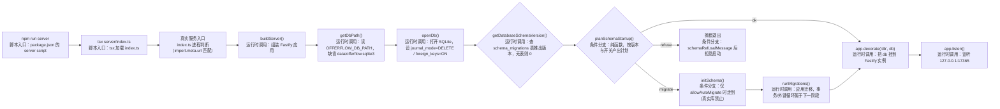

# OfferFlow 数据库启动生命线

> 一张可核查的学习图：从 `npm run server` 到 `app.listen()`，数据库如何被打开、探测版本并做出启动决策。
> 仅覆盖 **静态代码可确认** 的事实；运行时行为以「需要实验验证」明确标注。
>
> 注：`docs/architecture/server-dependencies.html` 是 dependency-cruiser 生成的全量**审计矩阵**（数百节点），
> 不是本学习主图；本图聚焦数据库启动主线。

## 证据索引

| 图中步骤 | 对应文件 | 对应函数或代码位置 | 可以确认的事实 |
| --- | --- | --- | --- |
| `npm run server` | package.json | `scripts.server = "tsx server/index.ts"` | 运行 `npm run server` 即执行 `tsx server/index.ts`。 |
| `tsx server/index.ts` | server/index.ts | 文件顶部（第 1-2 行，`import.meta` 判定） | `index.ts` 在模块加载时先执行 `loadProjectEnv()`，顶层 import 均在此之后求值。 |
| 真实服务入口 | server/index.ts | 第 274-334 行（`process.argv[1]` 判定） | 仅当以 `server/index.ts` 作为主程序运行（`import.meta.url` 匹配 `argv[1]`）时，才进入真实服务入口代码块，调用 `buildServer()` 并 `app.listen()`。 |
| buildServer() | server/index.ts | 第 111-245 行（函数定义），第 305-311 行（真实入口调用） | `buildServer` 内部先计算 `dbPath`（缺省 `getDbPath()`），然后 `openDb(dbPath)`，再决定是否走 schema 初始化逻辑，最后 `app.decorate('db', db)`。 |
| getDbPath() | server/db.ts | 第 9-11 行 | 返回 `process.env.OFFERFLOW_DB_PATH`，未设置时返回 `<repo-root>/data/offerflow.sqlite3`。 |
| openDb() | server/db.ts | 第 17-24 行 | 先 `ensureDbDir` 创建目录，再 `new Database(dbPath)`；执行 `journal_mode = DELETE` 与 `foreign_keys = ON`。 |
| getDatabaseSchemaVersion() | server/migrations.ts | 第 210-218 行 | 检查 `schema_migrations` 表是否存在；不存在返回 `0`；存在则读取记录并校验连续性，返回最大已应用版本。 |
| planSchemaStartup() | server/schemaStartup.ts | 第 20-34 行（函数定义），server/index.ts 第 167-173 行（调用） | 纯函数：`currentVersion===1` → `refuse(legacy_v1)`；`allowAutoMigrate` 时 `0` 或 `production≤v<required` → `migrate`；否则 `0`→`refuse(uninitialized)`、`v<required`→`refuse(too_old)`、`v>latest`→`refuse(too_new)`，其余 → `ok`。 |
| ok 分支 | server/index.ts | 第 174-180 行（if/else if 结构） | plan 为 `ok` 时不做任何 schema 操作，直接继续到 `app.decorate('db', db)`。 |
| migrate 分支 | server/index.ts | 第 174-176 行 | 仅 `plan.kind === 'migrate'` 时调用 `initSchema(db, { targetVersion })`，随后重新读取 schema 版本。 |
| refuse 分支 | server/index.ts | 第 177-180 行 | `plan.kind === 'refuse'` 时 `db.close()`（若 ownsDb）并 `throw` `schemaRefusalMessage(...)`，服务启动失败。 |
| initSchema() | server/schema.ts | 第 9-14 行 | 直接委托 `runMigrations(db, options)`，不包含额外逻辑。 |
| runMigrations() | server/migrations.ts | 第 220-304 行 | 遍历 `SCHEMA_MIGRATIONS` 应用未执行的迁移，写入 `schema_migrations` 与 `app_meta`；默认 `targetVersion = PRODUCTION_SCHEMA_VERSION`（v2），事务与外键细节本图不展开。 |
| app.decorate('db', db) | server/index.ts | 第 185 行 | 将数据库实例挂载到 Fastify 实例，供路由通过 `app.db` 使用。 |
| app.listen() | server/index.ts | 第 330-333 行（真实入口） | 监听 `127.0.0.1:17365`，错误时 `process.exit(1)`。 |

## 需实验验证的运行时行为

- **真实库启动默认允许自动迁移吗？** 代码事实：`allowAutoMigrate = !(ownsDb && dbPath === getDbPath())`（index.ts:164-165），即真实生产库为 `false`。真实入口启动后是否因此一定走 `refuse` 或 `ok`，取决于 `data/offerflow.sqlite3` 的实际 schema 版本——需要实验验证。
- **`planSchemaStartup` 的 `migrate` 分支在真实库上实际可达吗？** 静态代码显示真实库 `allowAutoMigrate=false`，`migrate` 分支只会因 `currentVersion===0` 或 `production≤v<required` 走 `refuse`。但若 `dbPath` 被 `OFFERFLOW_DB_PATH` 覆盖指向非真实库，`allowAutoMigrate` 会变为 `true`——此路径需要实验验证。
- **`getDatabaseSchemaVersion` 对异常库（如 `schema_migrations` 缺版本、乱序）**：静态代码会抛错，但具体报错文案与退出行为需实验验证。
