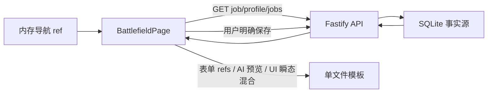
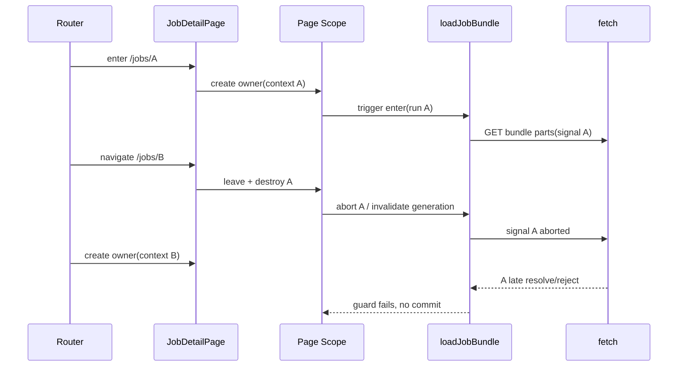

# OfferFlow v0.7.0-A 技术设计

- **状态**：Draft
- **输入**：OfferFlow v0.7 PRD Draft 0.4
- **基线**：OfferFlow v0.6.2
- **范围**：Router、岗位详情拆分、Page Scope、Runtime Gate 1
- **非范围**：v0.7.0-B/C 领域模型和动态画像
- **基线提交**：`a42e0e526d0778c4fef8e7ca305db77978483974`

---

## 1. 设计目标

v0.7.0-A 只解决页面与异步读取基建，不改变 OfferFlow 的业务语义和持久化模型。

目标：

1. 用 URL 取代 `App.vue` 内部导航状态，使岗位详情可刷新、可前进后退、可复制定位。
2. 将 `BattlefieldPage.vue` 迁移为一个有明确 owner 的 `JobDetailPage`，只拆出稳定产品区域。
3. 让服务端 / SQLite、页面服务端快照、编辑草稿和 UI 瞬态各有唯一所有者。
4. 在真实岗位详情页接入 `vue-page-scope`，验证单 owner、inject 和确定性销毁。
5. 在解决 peer compatibility 后，用 `vue-page-runtime` 承接第一个低风险读取任务 `loadJobBundle`。
6. 通过真实取消与 run 身份双重保护，消除 A → B → C 快速切换时的旧结果污染。
7. 建立组件、Router、Scope、Runtime、Abort 和销毁的最小自动测试能力。
8. 每个实施步骤可单独验收、单独回退，且不修改真实 Job 数据结构。

### 1.1 冻结决策摘要

| 决策 | v0.7.0-A 选择 | 核心依据 |
|---|---|---|
| Router history | `createWebHashHistory()` | Fastify 不托管前端且没有 history fallback；hash 刷新不依赖服务端改造 |
| 详情页 owner | `JobDetailPage.vue` 唯一 owner | 符合 Page Scope 单 owner 模型，避免子组件各建 Scope |
| Page Scope ID | 候选稳定 ID `job-detail` | RouterView key 只触发替换，不证明 registry 无重叠；必须通过 scope 0.2 同 ID 与真实 A→B 组件测试 |
| 服务端事实 | SQLite / HTTP API 唯一正式事实源 | Scope 不是数据库，也不是第二事实源 |
| 页面服务端快照 | `$source.bundle = { job, profile, allJobs }` | 三项均来自服务端，且当前详情决策真实依赖 `allJobs` |
| 编辑数据 | `state.jobDraft` + baseline fingerprint | 不直接修改 `$source.job`，保存成功后再用服务端响应 rebase |
| UI 瞬态 | 单区使用的状态留在子组件；跨区预览进入 Scope state | 避免 Scope 变巨型 Store，也避免雷达/报告/分析预览复制三份 |
| Runtime Gate 1 | `loadJobBundle`，`trigger: enter` | 页面进入必读、可取消、低风险；重试由 manual run 复用 |
| `loadJobBundle` 内容 | 并行读取 job、profile、allJobs，成功后一次提交 | 保持现有功能，避免当前 Job 与旧 allJobs 组合产生错误决策 |
| Runtime deps | 不使用 | 三个 GET 没有 run-before 依赖；内部 `Promise.all` 更符合真实关系 |
| 组件测试栈 | Vitest + `@vue/test-utils` + happy-dom | 当前 Playwright/tsx 无法挂载组件、注入 Scope、使用 fake timers 或检查 registry |
| SSE | Gate 1 不接管；保留稳定路径并预留 Gate 2 | Runtime 当前为 alpha，且现有 SSE 前后端尚无完整取消链 |

---

## 2. 当前架构事实

### 2.1 起点与依赖

| 项目 | 当前事实 |
|---|---|
| App 版本 | `0.6.2` |
| Vue | `^3.5.13` |
| Vite | `^6.0.7` |
| Fastify | `^5.9.0` |
| Vue Router | 未安装 |
| vue-page-scope | 未安装；待接入的公开版本事实为 `0.2.0` |
| vue-page-runtime | 未安装；当前公开版本事实为 `0.2.0-alpha.3` |
| 组件测试 | 无 |
| 现有测试 | tsx selftest + `@playwright/test` |

### 2.2 `App.vue` 导航

当前由三个内存 ref 驱动页面：

| 状态 | 含义 | 当前问题 | v0.7.0-A 归属 |
|---|---|---|---|
| `section` | profile / jobs 顶层区 | 刷新重置，浏览器历史不可见 | URL：`/profile`、`/jobs` |
| `jobsView` | list / battlefield | 刷新重置，无法深链接 | URL：`/jobs`、`/jobs/:jobId`、`/jobs/new` |
| `activeJobId` | 当前岗位 | 刷新丢失 | Router param `jobId` |

顶部按钮直接改 ref；`JobListPage` 用 `create/open` emit 进入详情；`BattlefieldPage` 用 `back/saved` emit 返回列表。刷新时 `activeJobId` 丢失，浏览器前进后退不能表达页面变化。

### 2.3 `BattlefieldPage.vue` 职责地图

当前文件约 3115 行，同时承担：

- Job/Profile/allJobs 读取与回填
- Job 新建、编辑和保存
- JD 文本、公司补充、图片粘贴和 OCR
- Prompt 生成与复制
- LLM/SSE 分析、chunk 追加和预览
- AI 原文解析、确认保存、雷达和报告
- 导入草稿 Review
- communicationStatus 与跟进事实编辑
- `deriveDecision`、目标画像评分和推荐话术派生
- matchScore、报告话术等独立写入
- loading/error/copy feedback/弹窗类瞬态
- watcher、object URL 和卸载清理

关键双写点：

1. `matchScore` 可由手工保存和 AI 确认保存两路写入。
2. `report.greetingMessage` 与独立 `greeting` ref 并存。
3. `report.applyAdvice` 与 `opportunityAnalysis.applyAdvice` 在 `decisionReport` 中择一。
4. `currentJob`、表单 refs 和服务端返回存在多份同义数据。

这些双写点必须先通过数据所有权收口，再拆组件；不能把现有 refs 原样复制进多个 Section。

### 2.4 API 与 SSE

普通 API：

- `src/api/client.ts` 使用原生 `fetch`。
- `apiRequest` 内部可接受 `RequestInit`，但公开的 `apiGet` / `apiSend` 不透传 `AbortSignal`。
- `jobsApi.get/list`、`profileApi.get` 均没有 signal 参数。
- AbortError 没有被区分，会被页面当成普通错误。
- Job 详情、保存分析、Review 和沟通事实都在同一个 Job JSON 中返回或写入。

当前 SSE：

- `llmApi.analyzeJobStream` 自行 `fetch` 并持有局部 reader，没有 signal，也没有 `reader.cancel()` 的外部时机。
- `BattlefieldPage.analyzeWithLlm` 在循环中直接 `aiRawResult += chunk`，没有 runId。
- 页面卸载只清理 OCR object URL，不取消 SSE 或 OCR Promise。
- 后端 `server/routes/llm.ts` 没有监听 client close，provider 也没有接收调用方 signal。
- SSE 只生成预览；SQLite 写入仍由用户点击“确认并保存分析结果”触发。

### 2.5 SPA 部署能力

- Vite 只配置 Vue 插件。
- Fastify 只提供 API，没有静态文件托管和 history fallback。
- 前端开发服务器与 Fastify 分端口，API 使用绝对地址 `127.0.0.1:17365`。
- Vite 开发环境可能兜底未知路径，但这不能证明正式静态部署支持 history fallback。

因此当前不能安全选择 `createWebHistory()`。

### 2.6 当前数据流



---

## 3. 非目标

v0.7.0-A 不进行以下工作：

- 不实现 ResumeVersion、Application、FeedbackEvent 或其他 v0.7.0-B/C 领域实体。
- 不实现求职漏斗、历史补录、动态岗位画像、策略窗口或 AI Proposal。
- 不创建新业务表，不修改 migration/schema/snapshot。
- 不让 Page Scope 或 Runtime 取代后端规则和 SQLite。
- 不让 Runtime Gate 1 接管 SSE。
- 不拆分全部 composable，不重写全部 API，不全面补旧 DTO。
- 不改造 strategyOverride，不大规模重做视觉层。
- 不启用 KeepAlive。
- 不使用 `--force`、`--legacy-peer-deps`、GitHub main、复制源码或修改 node_modules 绕过兼容性问题。

---

## 4. Router 方案

### 4.1 最终选择：`createWebHashHistory()`

v0.7.0-A 使用 hash history。URL 示例：

```text
http://localhost:5173/#/jobs/2kpDuukX2uq7O7fITEHw1
```

理由：

1. 当前 Fastify 不托管前端，也没有将未知非 API 路径回退到 `index.html`。
2. 当前没有正式生产静态服务器契约，不能依赖 Vite dev server 的行为推导生产行为。
3. hash 片段不发送给服务器，刷新和直接打开详情链接仍请求根 `index.html`。
4. API 使用绝对地址，不受 hash 路由影响。
5. v0.7.0-A 的目标是可靠路由与生命周期验证，不是 URL 美化。

### 4.2 路由表

| path | name | 页面 | 说明 |
|---|---|---|---|
| `/` | `home` | redirect | `replace` 到 `/jobs` |
| `/profile` | `profile` | `ProfileConfigPage` | 简历配置 |
| `/jobs` | `jobs` | `JobListPage` | 岗位列表 |
| `/jobs/new` | `job-new` | `JobCreatePage` | 新建岗位；不创建 `useJobDetailScope` |
| `/jobs/:jobId` | `job-detail` | `JobDetailPage` | 路由 props 接收 `jobId` |
| `/:pathMatch(.*)*` | `not-found` | `NotFoundPage` | 明确 404/返回岗位列表 |

未来路由只保留命名和路径规划，不提前创建空页面。后续阶段按真实功能增加 `/applications`、`/history-backfill`、`/strategy`、`/profile-versions`。

### 4.3 `App.vue` 新职责

`App.vue` 只保留：

- Naive UI provider、全局主题与页面外壳
- `RouterLink` / `router.push` 顶部导航
- `RouterView`
- 基于 route name 的导航高亮

删除 `section`、`jobsView`、`activeJobId` 及对应 emit 编排。列表页改为：

- 新建：`router.push({ name: 'job-new' })`
- 打开岗位：`router.push({ name: 'job-detail', params: { jobId } })`

详情页显式“返回岗位台账”使用 `/jobs`，浏览器后退仍保持真实历史语义。保存岗位后的行为保持 v0.6.2 语义：成功后 `replace` 到 `/jobs`，避免新建表单残留在后退栈中。

### 4.4 同路由参数切换

Vue Router 默认可能复用同一路由记录的组件。为让 Scope owner 与路由 Job 一一对应，`RouterView` 对 `job-detail` 使用 `jobId` 作为 component key；其他页面使用 route name。

效果：

```text
/jobs/A 离开
→ A JobDetailPage leave/destroy
→ A Scope abort/销毁
→ /jobs/B 创建新 JobDetailPage 与新 Scope
```

Scope 候选使用稳定 ID `job-detail`，但 **稳定 ID 与 RouterView key 都不是“不会重叠注册”的证明**。是否采用该 ID，必须先用 `vue-page-scope 0.2.0` 的真实 registry 行为和真实组件替换测试验证；具体实例仍通过 owner instance token 和 context jobId 审计。

### 4.5 参数、无效 ID 与 404

- Router 只做轻量规范化：参数必须是单个非空字符串且长度在合理上限内。
- 不用 UUID 正则限制，因为当前合法 ID 同时存在 UUID、nanoid 和 `jd_import_*`。
- 空参数不会进入详情路由。
- 合法形态但不存在的 ID 由 `GET /jobs/:id` 的 404 决定。
- 页面展示“岗位不存在”状态、原始 jobId 的安全摘要和返回列表按钮，不静默显示旧 Job，不自动创建记录。
- 其他错误展示可重试状态；AbortError 不展示为失败。

### 4.6 刷新、深链接和前进后退验收

至少验证：

1. 直接打开 `/#/profile`、`/#/jobs`、`/#/jobs/new`、`/#/jobs/:jobId`。
2. 在详情页刷新仍加载相同 Job。
3. 列表 A → B → 浏览器后退回 A。
4. 不存在的 Job 显示明确空状态。
5. 未保存草稿触发 route leave / `beforeunload` 提醒，不自动保存。

### 4.7 将来切换 history 的条件

只有部署层完成以下能力后才评估 `createWebHistory()`：

1. 明确由 Fastify 或独立静态服务器托管 `dist/`。
2. `/api/*`、`/jobs` API 等服务端路由优先匹配。
3. 仅对前端 GET 路径 fallback 到 `index.html`。
4. 直接请求 `/jobs/:jobId`、刷新、404、静态资源缓存均有集成测试。
5. Windows/Mac 当前启动方式与正式分发方式行为一致。

history 切换是独立发布任务，不与 v0.7.0-A 混做。

---

## 5. 页面拆分方案

### 5.1 目标目录

```text
src/pages/
├─ JobDetailPage.vue                 # 唯一 Page Scope owner / 路由编排壳
├─ JobCreatePage.vue                 # 新建流程，不复用已保存 Job 的 Scope
└─ job-detail/
   ├─ JobBasicInfoSection.vue
   ├─ JdInputSection.vue
   ├─ ImportReviewSection.vue
   ├─ CommunicationSection.vue
   └─ JobDecisionSection.vue

src/page-scopes/
├─ jobDetailScope.ts
└─ jobDetailTypes.ts
```

不以“行数下降”为目标。`AiAnalysisSection`、雷达和报告在 v0.7.0-A 先作为一个紧密耦合的分析工作区留在页面壳；完成数据所有权收口后才决定是否整体提取，不能先拆文件再复制状态。

### 5.2 迁移表

| 当前 `BattlefieldPage` 内容 | 未来位置 | v0.7.0-A 迁移 | 原因 |
|---|---|---:|---|
| route/jobId、读取、loading、错误、销毁 | `JobDetailPage` + `useJobDetailScope` | 是 | 页面级生命周期和事实快照必须有唯一 owner |
| 公司、岗位、城市、薪资、公司补充表单 | `JobBasicInfoSection` | 是 | 稳定输入区域；统一写 `state.jobDraft` |
| JD 文本、粘贴图片、OCR 队列 | `JdInputSection` | 是 | OCR 文件/object URL 自洽；仅通过 action 追加 JD 文本 |
| OCR queue、preview URL、单图进度 | `JdInputSection` 局部状态 | 是 | 浏览器资源不是服务端事实，也不应进入 Scope registry |
| 外部导入草稿 Review 面板 | `ImportReviewSection` | 是 | 边界稳定；调用 Scope 的 Review write action |
| communicationStatus、跟进次数、时间与备注编辑 | `CommunicationSection` | 是，Scope 化后 | 先统一 draft/写 Action，再移动模板，避免多份 ref |
| `deriveDecision` 卡片和推荐话术展示 | `JobDecisionSection` | 是，最后提取纯展示 | 输入来自 Scope getters，不在组件重复计算或写事实 |
| Prompt 生成与复制 | 分析工作区，后续可提取 `AnalysisPromptSection` | 否 | Prompt 同时依赖 profile、jobDraft、companyInput；先稳定所有权 |
| LLM/SSE、原文、解析预览、确认保存 | `JobDetailPage` 内分析工作区 | 否 | `saveAiResult` 与 match/report/radar 深耦合；Gate 2 前不迁 Runtime |
| 机会雷达、目标画像评分 | 分析工作区 / Scope getter | 否 | 多源选择尚需先消除，不为拆组件制造影子状态 |
| 分析报告与 greeting 编辑 | 分析工作区 | 否 | `report.greetingMessage` 与 greeting 双写需先收口 |
| matchScore 独立编辑 | 分析工作区 | 否 | 与 AI 确认保存共享同一服务端字段 |
| `parseOfferFlowJson`、`deriveDecision`、评分函数 | 现有纯函数模块 | 否 | 已有正确边界，不搬入 Scope |
| API adapters | `src/api/*` | 仅加 read signal | Scope 不直接拼 URL，不重写 API 层 |
| scoped 样式 | 随稳定 Section 移动 | 是，逐区 | 不做全页视觉重构 |

### 5.3 页面壳保留内容

v0.7.0-A 结束时 `JobDetailPage` 保留：

- Scope owner 创建与 context 注入
- route 级 loading / not-found / fatal error
- dirty navigation guard
- 分析工作区（Prompt、SSE、解析预览、雷达、报告、matchScore）
- Section 排列与页面级布局
- legacy SSE controller 的生命周期桥接，直到 Gate 2

### 5.4 本阶段不应该拆出的内容

- 不把每个 ref 变成 composable。
- 不将一个保存动作拆成多个子组件各自 PATCH。
- 不让 Section 缓存自己的 Job 副本。
- 不把纯函数移入 Scope actions。
- 不把 OCR object URL 放进 `$source` 或全局 registry。
- 不提前加入后续领域 Section。

---

## 6. Page Scope 方案

### 6.1 Owner 与注入

- Scope 名称：`useJobDetailScope`
- Scope ID：`job-detail`
- 唯一 owner：`JobDetailPage.vue`
- context：owner 已规范化的 `jobId`、必要的 Router 导航能力，以及测试时可替换的 API ports
- 子组件：只调用 `injectPageScope()` 获得同一实例
- 禁止：子组件再次调用 `useJobDetailScope()`、将实例挂到 window、全局单例或长期 Store

稳定 Scope ID 的放行条件：

1. 在 `vue-page-scope 0.2.0` 仓库测试同一 ID 重复注册的真实语义：覆盖、报错、并存还是先销毁后注册。
2. 在 OfferFlow 用真实 `RouterView` 与组件 key 执行 A → B 替换，记录 A unmount/registry remove 与 B owner registration 的精确顺序。
3. 明确替换窗口内是否出现瞬时重复 ID、是否抛 duplicate ID error，以及最终 registry 是否只剩 B。
4. 若库不允许任何重叠，调整 owner 的 leave/unmount/register 顺序，或使用库官方提供的 instance identity；不能只靠 key 推断安全。
5. 只有真实测试证明动态 `jobId` Scope ID 是唯一安全选择，且 registry 清理、调试可读性与缓存语义成本均有记录时，才允许改用动态 ID。

`JobCreatePage` 不创建 `useJobDetailScope`。新建成功后回到岗位列表；它可以复用纯展示/输入组件，但使用独立的 create draft。

### 6.2 数据所有权

| 数据类别 | 唯一所有者 | Scope 中的位置 | 规则 |
|---|---|---|---|
| 已保存 Job/Profile | Fastify + SQLite | `$source.bundle` 的页面期缓存 | 只由读取 Task 或写 Action 的服务端响应替换 |
| 已保存分析/Review/communication | Job 服务端记录 | `$source.bundle.job` 内字段 | 不另建 `savedAnalysis`、`reviewRecord` 影子副本 |
| allJobs | 服务端 Job 列表 | `$source.bundle.allJobs` | 只服务当前页面派生；不变成跨页全局 Store |
| 编辑中表单 | 当前 Page Scope | `state.jobDraft` | 从 source 建立副本；用户输入只写 draft |
| AI 流式预览 | 当前 Page Scope | `state.analysisDraft` | 未确认前不是服务端事实；跨雷达/报告区域共享 |
| OCR File/object URL | `JdInputSection` | 不进 Scope | 卸载时 revoke；转换结果通过 action 追加到 draft |
| copy/focus/hover/单区展开 | 对应 Section | 不进 Scope | 单区瞬态不污染页面 Scope |
| 决策与评分 | 纯函数 | getters | 不持久化、不缓存第二份结果 |
| Runtime loading | Page Runtime | `$loading.loadJobBundle` | 不再复制 `isLoading` ref |

### 6.3 `$source`

```ts
// 接口草案，不是实现代码
type JobDetailBundle = {
  jobId: string
  job: JobRecord
  profile: JobSeekerProfile | null
  allJobs: JobRecord[]
}

$source = {
  bundle: null as JobDetailBundle | null
}
```

`companyAssessment`、`opportunityAnalysis`、`aiRawResult`、`reviewStatus`、`importedDraft`、`communicationStatus` 均已包含在 `job` 中，不在 `$source` 再拆一份。

`loadedAt` 不属于服务端事实，不进入 `$source.bundle`。若页面需要观测最近一次读取完成时间，只能作为 Runtime/task 或页面只读诊断 metadata；它不参与 dirty fingerprint，不进入任何保存 payload，也不能驱动业务判断。

### 6.4 `state`

```ts
state = {
  jobDraft: null as JobEditDraft | null,
  baselineFingerprint: '',
  analysisDraft: emptyAnalysisDraft(),
  loadError: null as PageLoadError | null,
  actionStatus: emptyActionStatus()
}
```

- `JobEditDraft` 是可编辑字段的明确白名单，不是完整 `JobRecord` 深拷贝。
- `baselineFingerprint` 基于规范化 draft，用于纯 getter 判断 dirty。
- `analysisDraft` 保存未确认的 raw text、解析预览、warnings、legacy stream runId/error；不覆盖 `$source.job`。
- 单区 copy feedback、OCR queue、对象 URL 和 DOM 状态留在子组件。

### 6.5 getters

| getter | 来源 | 说明 |
|---|---|---|
| `jobId` | owner context | 已规范化路由参数 |
| `job` / `profile` / `allJobs` | `$source.bundle` | 只读访问 |
| `hasJob` | source | 是否已加载 |
| `isDirty` | draft fingerprint vs baseline | 纯比较，不依赖 watch |
| `canSaveJob` | draft | 复用当前“至少一个字段”规则 |
| `pendingReview` | `isPendingReview(job)` | 现有纯函数 |
| `decisionRecord` | source + draft | 构造纯派生输入，不落库 |
| `followupDecision` | `deriveDecision(decisionRecord, allJobs)` | 保留跨 Job companyWarning 语义 |
| `profileScore` | draft + source analysis | 调用现有纯函数 |
| `effectiveAnalysis` | confirmed source / unconfirmed preview | 展示层选择，不修改正式事实 |

### 6.6 actions

| action | 类型 | 服务端写入 | 成功后的 source 处理 |
|---|---|---:|---|
| `saveJobDraft` | 用户命令 | PATCH Job | 返回完整 Job → `acceptUpdatedJob` |
| `confirmAnalysis` | 用户命令 | PATCH Job | 先本地纯解析；返回完整 Job → `acceptUpdatedJob(..., 'confirmAnalysis')` |
| `submitImportReview` | 用户命令 | PATCH Job | 返回完整 Job → `acceptUpdatedJob` |
| `updateCommunication` | 用户命令 | PATCH Job | 返回完整 Job → `acceptUpdatedJob` |
| `saveMatchScore` | 用户命令 | PATCH Job | 返回完整 Job → `acceptUpdatedJob` |
| `saveGreeting` | 用户命令 | PATCH report | 返回完整 Job → `acceptUpdatedJob`，消除 greeting 独立事实副本 |
| `appendOcrText` | 页面编辑命令 | 否 | 只修改 `jobDraft.jdText` |
| `discardDraftAndReload` | 页面命令 | 否 | 清理 draft 后 manual 运行读取 Task |

所有返回完整 Job 的写 Action 必须进入同一个 `acceptUpdatedJob(updatedJob, reason)`，而不是各自替换局部字段：

1. 原子替换 `$source.bundle.job`。
2. 按 ID 替换 `$source.bundle.allJobs` 中的同一 Job；若列表中不存在该 ID，按列表的正式排序/过滤规则插入，无法证明规则时立即 reload bundle，禁止静默遗漏。
3. 从 `updatedJob` 重建 `state.jobDraft`，并更新 `baselineFingerprint`。
4. 默认保留尚未确认的 `state.analysisDraft`；只有 `reason === 'confirmAnalysis'` 才能按确认成功语义清理或 rebase 它。
5. 整个入口显式调用，不通过 watcher 同步。

只替换 `bundle.job` 会让 `deriveDecision(decisionRecord, allJobs)` 继续读取 `allJobs` 中同 ID 的旧记录，造成公司提示、跟进判断或其他跨 Job 派生结果短暂失真。因此 `job` 与 `allJobs` 的一致更新是写成功提交的一部分，不是可选刷新优化。

写 Action 不通过 Runtime `canRun` 充当业务门禁。门禁由 action 输入校验、后端 DTO 和后端领域规则共同负责。

写请求不绑定 route read AbortSignal：客户端取消无法保证服务端没有完成写入。提交中默认禁止离页/重复点击；若 owner 已销毁，返回结果不再写页面状态，但服务端结果仍以数据库为准。

### 6.7 watch 策略

v0.7.0-A 的业务 watch 初始为空：

- draft dirty 使用 getter，不通过 watcher 维护布尔影子状态。
- load 成功后显式调用 `acceptBundle()` 建立 draft，不 watch `$source` 自动复制。
- action 成功后显式调用 `acceptUpdatedJob()` 原子更新 job/allJobs 并 rebase，不依靠 watcher 猜测来源。
- JobDetail 组件按 jobId key 重建，不 watch route param 复用 owner。

只有出现真实外部订阅需求时才新增 watch，并要求 disposer 纳入销毁测试。

### 6.8 生命周期

| 阶段 | 行为 |
|---|---|
| `init` | 校验 context、初始化空 source/state、安装 Runtime task；不发网络请求 |
| `enter` | 自动触发 `loadJobBundle`；记录 owner instance token |
| active | 用户编辑 draft；Section inject 同一 Scope |
| route leave guard | dirty 或 write in-flight 时请求用户确认；取消导航则不 leave |
| `leave` | generation 失效、abort 读取 Task、停止页面级订阅；初期无 KeepAlive |
| `destroy` | 标记 destroyed、再次使 generation 失效、取消 legacy stream、释放 disposer，交由库移除 registry/effectScope |

刷新或关闭页面时使用 `beforeunload` 提醒未保存 draft，但不把草稿写入 localStorage 或 SQLite。

### 6.9 Scope 不是第二事实源

```text
SQLite / Fastify          唯一正式事实
        ↓ GET
$source.bundle            当前页面服务端快照
        ↓ create draft
state.jobDraft            未保存编辑
        ↓ 用户 Action
PATCH → 服务端响应         新事实
        ↓ atomic replace
$source + draft rebase
```

---

## 7. Runtime peer compatibility 前置阻塞

### 7.1 当前发布事实

| 包 | 当前发布版本 | 相关 peer |
|---|---|---|
| `vue-page-scope` | `0.2.0` | Vue `^3.2.0` |
| `vue-page-runtime` | `0.2.0-alpha.3` | `vue-page-scope ^0.1.0` |

npm 的 0.x caret 规则下，`^0.1.0` 表示 `>=0.1.0 <0.2.0`，不包含 `0.2.0`。因此当前两个发布版本不能视为 peer compatible；这会阻塞 OfferFlow Runtime Gate 1。

### 7.2 解除阻塞流程

必须在 `vue-page-runtime` 仓库完成：

1. 增加 `vue-page-scope 0.2.0` 的真实 Vue 3 集成 fixture。
2. 验证 `registerPlugin` 与 Scope plugin 顺序。
3. 验证 tasks 安装和 owner/inject 使用。
4. 验证 init / enter / leave / destroy 生命周期只执行一次。
5. 验证 `$loading` 在 success/error/abort/skip 后恢复。
6. 验证重复 run abort 旧任务和 signal 透传真实 fetch。
7. 验证 canRun=false、reset 同步幂等、manual/enter trigger。
8. 验证 TypeScript 类型在 Vue 3 + scope 0.2.0 组合下通过。
9. 根据测试结果决定 peer 范围；技术设计不预先写死范围。
10. 发布新的 alpha 或 stable 版本。
11. OfferFlow 精确锁定通过 Gate 的 scope/runtime 版本，再开始 Gate 1。

不能通过忽略 warning、强制安装、修改 node_modules、引用未发布 main 或复制 Runtime 源码解除阻塞。

### 7.3 前置 Gate 输出证据

- runtime 仓库测试命令和结果
- peer dependency diff
- 新发布版本与 npm metadata
- OfferFlow dry-run 安装无 peer conflict
- OfferFlow typecheck 的组合类型结果

这些证据缺一时，Router/Page Scope 可在独立提交中继续准备，但 Runtime Gate 1 不得合并为完成状态。

---

## 8. Runtime Gate 1：`loadJobBundle`

### 8.1 为什么是 bundle

当前详情加载真实需要：

- `jobsApi.get(jobId)`：详情与不存在语义
- `profileApi.get()`：Prompt 输入
- `jobsApi.list()`：`deriveDecision(..., allJobs)` 的同公司提示

因此 Gate 1 定义一个任务，内部并行三个 GET，全部成功并通过 run guard 后一次提交。若把 allJobs 拆成独立 Task，页面可能短暂将 C Job 与 A/B 的 allJobs 组合，破坏现有 `companyWarning` 语义。

当前本地数据规模很小，三次读取的清晰性高于提前优化。未来 Job 数量显著增长时，再用后端 bundle/summary endpoint 替代全量列表；v0.7.0-A 不新增 endpoint。

### 8.2 Task 配置

| 字段 | 设计 |
|---|---|
| task name | `loadJobBundle` |
| trigger | `enter` |
| manual | Retry、明确丢弃草稿后的 refresh |
| canRun | jobId 非空、owner 未销毁、不是 create route |
| reset | 同步清空旧 bundle、draft、loadError，并使 generation 失效 |
| deps | 不使用 |
| loading | Runtime `$loading.loadJobBundle` |
| error | 404 → not-found；AbortError → 静默；其他 → retry error |
| abort | 重复 run、leave、destroy 均 abort 当前读取 |

选择 `enter` 而不是 `init`，因为数据只在页面真正进入时需要，且 enter/leave 与 Router 可见生命周期一致。Retry 直接 manual run 同一 Task，不创建第二套读取逻辑。

Gate 集成期在 `src/config/features.ts` 设置构建期 `runtimeJobBundleEnabled`，默认 false；direct loader 与 Runtime loader 必须调用同一个 `acceptBundle`，不能各自维护 source/draft。全部 Gate 1 验收通过后默认开启，并在稳定观察期结束后删除 direct loader 与该 flag，避免永久双路径。

### 8.3 伪代码

```ts
// 说明身份与提交顺序，不代表 Runtime 的最终 API 语法
async run({ signal }) {
  const runId = ++latestRunId
  const requestedJobId = context.jobId

  const [job, profile, allJobs] = await Promise.all([
    jobsApi.get(requestedJobId, { signal }),
    profileApi.get({ signal }),
    jobsApi.list({ signal })
  ])

  const candidate = { jobId: requestedJobId, job, profile, allJobs }

  if (signal.aborted) return
  if (destroyed) return
  if (runId !== latestRunId) return
  if (context.jobId !== requestedJobId) return

  acceptBundle(candidate) // 唯一一次 source 写入，同时建立 draft
}
```

请求结果先保存在局部变量中。禁止先逐项写 `$source`，再期待 abort 回滚。

### 8.4 API client 最小改造面

| 文件 | 设计变更 |
|---|---|
| `src/api/client.ts` | read options 透传 `signal`；提供 `isAbortError`，不把取消包装成 ApiError |
| `src/api/jobsApi.ts` | `get/list` 接受 read options |
| `src/api/profileApi.ts` | `get` 接受 read options |
| `src/page-scopes/jobDetailScope.ts` | Task 传入 signal，执行 commit guard |

写 API 保持原命令语义，不自动绑定页面读取 signal。

### 8.5 Gate 1 验收

1. enter 后读取并展示正确 Job。
2. 无效 jobId 触发 canRun skip。
3. skip 的 reset 不保留上一 Job。
4. manual 重跑取消旧请求。
5. success/error/abort/skip 后 loading 都恢复。
6. 404 与普通错误状态可区分。
7. destroy 后 Promise 即使 resolve 也不能提交。
8. A → B → C 最终只提交 C。
9. 没有数据库写请求。

---

## 9. Tasks / Actions 边界

| 操作 | 分类 | Runtime | 理由 |
|---|---|---:|---|
| 进入详情读取 job/profile/allJobs | Task | Gate 1 | 可取消、路由切换应终止 |
| Retry / refresh bundle | Task manual run | Gate 1 | 与 enter 使用同一读取逻辑 |
| LLM SSE 分析 | Task 候选 | Gate 2 才接入 | 当前链路高风险，先保留稳定实现 |
| OCR File 转文字 | Section 局部异步操作 | 否 | 浏览器文件资源局部，不是页面服务端查询 |
| `deriveDecision` / 评分 / JSON parse | 纯函数 | 否 | 同步派生，不是异步任务 |
| 创建 Job | Action | 否 | 写 SQLite 的用户命令 |
| 保存 Job draft | Action | 否 | 写 SQLite |
| 确认分析结果 | Action | 否 | Human-in-the-loop 写门禁 |
| 提交 Review 决议 | Action | 否 | 写正式状态 |
| 更新 communicationStatus/跟进事实 | Action | 否 | 写正式事实 |
| 保存 matchScore / greeting | Action | 否 | 写 Job |

Runtime canRun 只判断读取任务是否具备运行条件，不是数据库写业务门禁。写 Action 成功后可以 manual reload bundle，但只有 draft 已 clean 或用户明确丢弃时才执行 reset。

---

## 10. AbortSignal 与竞态

### 10.1 两层保护

第一层：真实取消。

```text
Router leave / component key change
→ Scope leave/destroy
→ Runtime task.abort()
→ AbortSignal 透传 jobsApi/profileApi
→ fetch 中断
→ AbortError 静默结束
→ Runtime loading 恢复
```

第二层：提交保护。

写 `$source` 前同时检查：

- signal 未 abort
- owner 未 destroyed
- runId 等于 latestRunId
- requestedJobId 等于当前 context jobId
- owner instance token 仍有效

取消不是事务，也不能回滚已经执行的赋值，所以所有异步结果必须“先收集、后校验、一次提交”。

### 10.2 生命周期时序



### 10.3 A → B → C 自动测试

测试在 500ms 内依次导航：

```text
/jobs/A → /jobs/B → /jobs/C
```

使用三个可控 deferred response：A 最慢、B 次慢、C 正常；即便测试替身故意忽略 abort 并让 A/B 在 C 后 resolve，commit guard 仍必须拒绝旧结果。

断言：

1. 页面只展示 C。
2. A/B signal 的 `aborted === true`。
3. A/B 的 candidate 从未进入 `acceptBundle`。
4. C 是唯一有效 source bundle。
5. 三个 run 的 loading 都结束。
6. 无 unhandled rejection 和 console error。
7. registry 最终只有 C 的当前实例，离开 C 后为 0。
8. 无 timer/event/watcher disposer 残留。
9. fetch spy 只出现 GET，不出现 POST/PUT/PATCH/DELETE。

---

## 11. 测试设计与最小依赖

### 11.1 当前缺口

现有 tsx selftest 擅长纯函数、SQLite 和 API 集成，但不能可靠完成 Vue 组件挂载、Router memory history、provide/inject、fake timers 和 Scope registry 断言。现有 `@playwright/test` 是浏览器 E2E 包，不包含 Vue component testing adapter；只靠 E2E 很难控制 Promise 返回顺序和检查内部 registry。

### 11.2 最小新增测试栈建议

| dev dependency | 必要性 | 用途 | 能否避免 |
|---|---|---|---|
| `vitest` | 必需 | 与 Vite/TS 集成，mock、spy、fake timers、异步断言 | 不能；手写 tsx runner 会重复造测试框架 |
| `@vue/test-utils` | 必需 | 挂载 owner/Section，验证 provide/inject、unmount | 不能；Playwright 当前未安装 Vue CT adapter |
| `happy-dom` | 必需 | 提供轻量 DOM、history、事件和卸载环境 | 需要 DOM 实现；相比 jsdom 只选一个，不同时安装 |

不新增 fetch mock 库、timer 库或断言库：Vitest 已提供 spy/fake timers，Node 已提供 `AbortController`、`fetch` 和 `ReadableStream`。

精确版本在实施时根据当前 Node/Vite/Vue 兼容矩阵确定并写入 lockfile；本技术设计不安装依赖。

### 11.3 测试分层

| 层级 | 建议文件 | 验证内容 |
|---|---|---|
| API 单元 | `src/api/__tests__/client.abort.spec.ts` | signal 透传、AbortError 不包装、普通 HTTP error 保持 |
| Scope 单元 | `src/page-scopes/__tests__/jobDetailScope.spec.ts` | source/draft、canRun/reset、runId、atomic commit、actions |
| 组件集成 | `src/pages/__tests__/JobDetailPage.spec.ts` | owner 唯一、Section inject、dirty guard、not-found |
| Scope ID 替换 | `src/pages/__tests__/JobDetailPage.scope-id.spec.ts` | 真实组件 A→B 替换顺序、瞬时 duplicate、错误行为、最终仅 B |
| Router 竞态 | `src/pages/__tests__/JobDetailPage.race.spec.ts` | memory history A→B→C、abort、旧结果不提交、registry |
| 销毁审计 | `src/pages/__tests__/JobDetailPage.destroy.spec.ts` | watcher/timer/event/task 清理、重新进入干净 |
| Legacy SSE | `src/pages/__tests__/JobDetailPage.stream-lifecycle.spec.ts` | 重跑/离页 abort、`reader.cancel()`、runId/jobId/owner guard |
| OCR 局部生命周期 | `src/pages/job-detail/__tests__/JdInputSection.spec.ts` | unmount 后不写 draft、owner token、object URL 全释放 |
| 浏览器 smoke | `tests/router-navigation.spec.ts` | hash 深链接、刷新、前进后退、404 UI |
| Runtime 仓库 Gate | runtime 自身 integration fixture | peer、plugin、lifecycle、loading、abort、类型 |

### 11.4 Mock 规则

- API 通过注入的 read ports 或 `vi.stubGlobal('fetch')` 替换，不修改生产 API URL。
- Deferred fetch mock 必须记录接收到的 signal。
- 一组测试让 mock 尊重 abort，验证真实取消；另一组故意忽略 abort，验证 runId 防旧写。
- 使用 `createMemoryHistory()` 测组件竞态；浏览器 smoke 使用正式 hash history。
- registry 只通过库公开 API检查，不把 Scope 暴露到 window。
- Scope ID 测试必须使用 `vue-page-scope 0.2.0` 的真实 registry 和真实组件 mount/unmount，不用手写假 registry 证明自己。
- 测试结束统一断言无 pending timer、无未处理 Promise，并恢复 console spy。

---

## 12. Scope 销毁审计

### 12.1 可测试标准

| 资源 | 离开详情后的标准 | 验证方式 |
|---|---|---|
| Scope registry | owner 实例移除 | 公共 registry 查询为 0 |
| Vue watcher/computed | effectScope stop | 离开后变更测试 ref 不再触发 spy |
| Runtime task | 所有 pending read abort | signal、task state、loading 断言 |
| event handler | 全部 disposer 执行 | fake event bus listener count 为 0 |
| interval/timeout | 全部清理 | fake timers pending count 为 0 |
| OCR object URL | 全部 revoke | `URL.revokeObjectURL` spy |
| legacy SSE | owner controller abort；reader 最终 cancel | Gate 2 前兼容路径的专门测试 |
| 子组件 | unmount 后无引用 | wrapper/unmount + WeakRef 可选辅助，不作为唯一证据 |
| 全局对象 | 不持有 Scope | 静态检查 + window key 审计 |
| 再次进入 | source/state 全新 | A 离开后重新进 A 不出现旧 draft/error/loading |

### 12.2 KeepAlive

v0.7.0-A 不启用 KeepAlive。未来启用前必须另测 activated/deactivated 与 enter/leave，证明不会重复 task、watch 或订阅；不能把当前 destroy 语义直接套到 deactivated。

### 12.3 Legacy Async Lifecycle Hardening

这是 OfferFlow 页面基础轨道中的独立阶段，**不属于 Runtime Gate 1，也不等待 Runtime SSE Gate 2**。Gate 2 决定未来是否由 Runtime 接管流任务；本阶段只修复现有 legacy SSE 与 OCR 在组件销毁、重复执行和路由切换时的旧写风险。

#### SSE

- `llmApi.analyzeJobStream` 的 legacy 调用增加可选 `AbortSignal`，不改变现有分析协议或确认保存流程。
- async generator 必须在 `finally` 中执行 `reader.cancel()` 或等价的 cancel/release cleanup；正常结束、异常、主动 abort 和消费者提前退出都覆盖。
- `JobDetailPage` owner 持有当前 stream 的 `AbortController`；重复分析先 abort 旧 stream，再增加 latest stream runId 并启动新流。
- 每个 chunk 写 `analysisDraft` 前同时检查 signal 未 abort、owner 未 destroyed、route jobId 仍等于启动时 jobId、runId 仍等于 latest stream runId。
- route leave 与 owner destroy 都 abort 当前 stream；销毁后的 resolve/chunk/error 只能被丢弃，不能恢复旧 loading 或覆盖新页面状态。
- 该链路仍是 legacy flow，不注册为 Runtime task；Human-in-the-loop 的“确认并保存分析结果”门禁保持不变。

#### OCR

- `JdInputSection` 为每次 OCR 操作记录本地 owner token/mounted generation，并记录结果预期写入的 draft 身份。
- Promise 完成时仅在组件仍 alive、token 仍有效且目标 draft 仍是当前有效编辑对象时调用 `appendOcrText`；否则静默丢弃结果。
- 每个 preview object URL 在单项删除时 revoke，组件 unmount 时再次统一释放剩余 URL，并用测试证明没有遗漏。
- 本阶段不要求底层 OCR adapter 支持 `AbortSignal`；“不能中断计算”不等于“允许卸载后写状态”，提交 guard 是硬条件。

#### 验收

1. 重复启动 SSE 时旧 reader 被取消，旧 chunk 不进入新 run。
2. A → B → C 与 destroy 后，legacy SSE 无旧写、无未处理 rejection，最终 loading/error 属于当前 owner。
3. generator 的 done/error/abort/consumer-return 路径均执行 cancel/release。
4. OCR 在 unmount、切换 Job 或目标 draft 失效后 resolve，不写 Scope/draft。
5. 删除图片与 unmount 后所有 object URL 均已 revoke。
6. 本阶段不启用 Runtime SSE flag，不修改后端流取消链，也不绕过分析确认。

---

## 13. SSE Gate 2 预留

Gate 1 不删除或 Runtime 化当前 SSE。Legacy Async Lifecycle Hardening 已先保证前端旧链路的 owner 取消和旧写保护；Gate 2 只冻结未来 Runtime 接管与端到端后端取消边界：

### 13.1 前端接口

- Runtime adapter 复用 A7 已验证的 `llmApi.analyzeJobStream(input, { signal })`，不另造传输接口。
- generator 的 `finally` 继续保证 `reader.cancel()` / release cleanup。
- Runtime task 写同一个 `state.analysisDraft` preview，并沿用 signal、destroyed、jobId、latest stream runId 四项 guard。
- 重复分析继续先取消旧 stream，不能交叉追加。

### 13.2 feature flag

在 `src/config/features.ts` 定义构建期 flag，例如 `runtimeSseEnabled`，默认 false。flag 不放 localStorage、不由 Job 数据控制，也不形成两份业务事实。

```text
false → 当前 legacy controller
true  → Runtime streamJobAnalysis Task
```

两条路径必须写入同一个 `analysisDraft` commit API；Gate 通过后删除 legacy adapter 和 flag。

### 13.3 后端取消链

Gate 2 需要：

1. Fastify 路由监听 request/reply raw close。
2. 为每次流创建 AbortController。
3. close 时 abort provider 调用并停止 `reply.raw.write`。
4. provider 接受 caller signal，并与 timeout signal 组合，不能用内部 controller 覆盖调用方 signal。
5. reader 在 finally 中 cancel/release。
6. retry sleep 也响应 abort，不在客户端断开后重试。

### 13.4 Gate 2 退出条件

- 前端 abort 后无旧 chunk。
- 后端观察到 client close 并停止上游读取。
- 重复分析不交叉。
- loading/error 在 done/error/abort/destroy 全部恢复。
- feature flag 两条路径行为等价。
- 通过后才删除 v0.6.2 稳定 SSE 路径。

---

## 14. 实施顺序

实施先分成两个可以并行推进、独立回滚的轨道。Router、Page Scope 与测试基建不依赖 Runtime 发布，不得被 Runtime compatibility 阻塞；每一行仍是独立可审查提交。

### Track A：OfferFlow page foundation

| 阶段 | 修改范围 | 验收点 | 失败回退 | 用户数据影响 |
|---|---|---|---|---|
| A1. 基础依赖 | 精确安装 Router、Scope 及 Vitest/Test Utils/happy-dom；不安装 Runtime | 无 peer warning，typecheck/build 通过 | revert package/lock 单提交 | 无 |
| A2. Hash Router | router 配置、main 安装、hash routes、NotFound | 深链/刷新/前进后退 smoke | revert Router 提交，恢复 App 内存导航 | 无 |
| A3. URL 导航 | App/JobList emit 改为 router push | create/open/back/save 语义一致 | revert 导航提交 | 无 |
| A4. 详情页壳 | `BattlefieldPage` 最小迁移为 `JobDetailPage`，route props/key | 行为与 v0.6.2 一致 | revert rename/route mapping | 无 |
| A5. Page Scope owner | source/draft/getters/actions、`acceptBundle`、`acceptUpdatedJob`、owner/inject、dirty guard | job/allJobs 一致；owner/inject/destroy 通过 | revert Scope 提交；页面回到原本本地状态 | 无持久化结构变化 |
| A6. Scope ID Gate | scope 0.2 同 ID行为 + 真实 A→B 组件替换 | 顺序、duplicate error、最终仅 B 均有证据 | 调整生命周期/官方 identity；不放行 owner | 无 |
| A7. Legacy Async Lifecycle | legacy SSE signal/controller/runId/reader cleanup；OCR owner token/unmount guard | SSE/OCR 专门测试全绿 | revert lifecycle 单提交，暂停后续拆分 | 无 |
| A8. 稳定 Section | Basic/JD/Review/Communication/Decision 分步提取 | 每区交互与写 API 不变 | 单 Section revert | 无 |

### Track B：vue-page-runtime compatibility repo

| 阶段 | 修改范围 | 验收点 | 失败回退 | 用户数据影响 |
|---|---|---|---|---|
| B1. scope 0.2 集成 | runtime 仓库增加真实 Vue 3 + scope 0.2.0 fixture | plugin、owner/inject、lifecycle、loading、abort、类型通过 | 不改 peer、不发布 | 无 |
| B2. Compatibility/peer | 根据测试修复 runtime 并确定 peer 范围 | 全量测试与类型检查通过 | 保留旧 alpha | 无 |
| B3. Runtime release | 发布经验证的新版本并核对 npm metadata | tarball/metadata/peer 正确 | 不在 OfferFlow 使用该版本 | 无 |
| B4. OfferFlow no-conflict install | OfferFlow 精确安装 Scope/Runtime 组合 | install 无 peer conflict，typecheck/build 通过 | revert Runtime package/lock 单提交 | 无 |

### 两轨合流后：Runtime Gate 1

只有 A1-A7 与 B1-B4 都通过后才合流：先为 `client/jobs/profile` read API 增加 `AbortSignal`，再接入 Runtime `loadJobBundle` 的 enter/manual、runId、loading/error/abort/skip 与 A→B→C 测试。direct loader 与 Runtime loader 必须调用同一个 `acceptBundle`；Runtime Gate 1 稳定后才删除 direct loader。Legacy SSE 继续使用 A7 已加固的路径，直到独立 Gate 2 完成。

合流失败时将 feature flag 切回 direct loader 或 revert Runtime 集成提交；Track A 的 Router、Page Scope、测试基建与 legacy 生命周期加固继续保留，不随 Runtime 回滚。

---

## 15. 回滚方案

### 15.1 原则

- v0.7.0-A 不改数据库 schema，代码回滚不需要数据回滚。
- 每个阶段独立 commit；优先 revert 单阶段，不 reset/rewrite 历史。
- 所有读取实现通过同一 API port 和 `acceptBundle`，切换 loader 不切换事实模型。
- 写 Action 沿用现有 endpoint；Scope/Runtime 失败时可以回到原页面控制器。

### 15.2 触发回滚的条件

- peer conflict 或类型不兼容。
- owner/inject 出现多实例。
- A→B→C 出现任一旧写。
- abort/skip/error 后 loading 残留。
- 详情页写入行为与 v0.6.2 不一致。
- registry/watcher/timer/task 任一泄漏。
- hash 深链接或刷新失败。

### 15.3 回滚层级

1. Runtime loader flag 切回 direct loader。
2. 回退最近的 Section 提取，保留 Scope owner。
3. 回退 Scope 提交，保留 Router + 未拆详情页。
4. 回退 Router 提交，恢复 v0.6.2 App 内存导航。

任一层级都不修改或删除真实 Job 数据。

---

## 16. 风险

| 风险 | 影响 | 护栏 |
|---|---|---|
| Runtime peer 不兼容 | Gate 1 无法合法安装 | runtime 仓库先测、先发布，OfferFlow 精确锁定 |
| Runtime alpha 的 Vue3 适配不足 | loading/lifecycle/abort 不可靠 | Gate 1 仅低风险读；保留 direct loader fallback |
| Scope 变成巨型 Store | 从巨型 Page 变成巨型 Scope | source/state/local 矩阵；纯函数不搬入；低风险 Section 先拆 |
| allJobs 规模增长 | 每次详情读取变重 | A 保持现有语义；后续用 bundle/summary endpoint 独立优化 |
| draft 与 source 双写 | 保存/分析结果不一致 | source 不原地编辑；Action 成功响应原子 rebase |
| Job 与 allJobs 写后分叉 | `deriveDecision` 读取同 ID 旧记录 | 所有写响应统一走 `acceptUpdatedJob`，同步替换/插入或 reload |
| route component 复用 | A Scope 未销毁就加载 B | RouterView 以 jobId key，并以真实 scope 0.2 重叠注册测试作为 Gate |
| 稳定 Scope ID 重叠 | duplicate error 或错误实例被 inject | 验证 remove/register 顺序；必要时调整 lifecycle 或使用官方 identity |
| abort 被 mock 掩盖 | 真实网络仍串数据 | 同时测试尊重 abort 与忽略 abort 的 deferred mock |
| 写请求在离页时不确定 | 服务端可能已写但前端取消 | 写请求不绑 read signal；提交锁和离页 guard |
| hash URL 外观 | URL 含 `#` | 可靠性优先；有正式 fallback 后再独立迁 history |
| legacy SSE 卸载后继续 | 页面资源与 chunk 风险 | A 预留 signal/runId 接口并由 owner 取消；Runtime 接管留 Gate 2 |
| OCR Promise 无取消 | 卸载后局部异步继续 | JdInput owner token + unmount guard；不写全局/Scope source |
| 测试依赖增加 | lockfile 与维护成本 | 只新增 Vitest/Test Utils/单一 DOM 实现，不再加 mock 库 |

---

## 17. 验收标准

### Router

- [ ] 使用 hash history，根/profile/jobs/new/detail/not-found 路由可用。
- [ ] 详情深链接刷新不丢 jobId。
- [ ] 浏览器前进后退语义正确。
- [ ] 不存在 Job 显示明确空状态，不显示旧数据。
- [ ] App 不再维护 section/jobsView/activeJobId。

### Page / Scope

- [ ] `JobDetailPage` 是唯一 owner。
- [ ] 所有 Section inject 同一 Scope 实例。
- [ ] `$source` 只包含服务端 bundle，draft 与 UI 瞬态分层明确。
- [ ] `loadedAt` 等读取 metadata 不进入 source、dirty fingerprint 或保存 payload。
- [ ] 没有同一 Job/analysis/review 的第二份正式事实。
- [ ] 所有写响应经 `acceptUpdatedJob` 同步更新 job/allJobs、rebase draft；未确认 analysisDraft 不被非确认 Action 覆盖。
- [ ] dirty guard 不自动保存或丢弃草稿。
- [ ] 低风险 Section 完成最小拆分，分析工作区未被强拆。
- [ ] scope 0.2 同 ID 语义和真实 A→B 替换均有证据；最终 registry 仅 B，且无未解释 duplicate error。

### Runtime Gate 1

- [ ] peer compatibility 已在 runtime 仓库验证并发布新版本。
- [ ] OfferFlow 精确锁定通过 Gate 的版本，无 peer warning。
- [ ] `loadJobBundle` 使用 enter，manual retry 复用同一任务。
- [ ] canRun/reset/loading/error/abort/skip 全部有测试。
- [ ] v0.7.0-A 不使用 deps。
- [ ] Gate 1 不接管 SSE。

### Abort / race / destroy

- [ ] read signal 到达真实 fetch。
- [ ] 每个 run 有 generation/runId。
- [ ] 结果只在 signal、owner、route、run 四项都有效时提交。
- [ ] A→B→C 最终只展示 C，无数据库写。
- [ ] registry、watcher、event、timer、task、object URL 全部可验证清理。
- [ ] legacy SSE 重跑/leave/destroy 会 abort，generator finally 执行 `reader.cancel()` 或等价清理，旧 chunk 被四项 guard 拒绝。
- [ ] OCR 即使底层不可取消，owner token/mounted/目标 draft guard 也能阻止 unmount 后写入。
- [ ] 初期未启用 KeepAlive。

### 回归

- [ ] typecheck、build、现有 selftest/Eval 通过。
- [ ] Router/Scope/Runtime 新测试通过。
- [ ] 保存 Job、确认分析、Review、communication 行为与 v0.6.2 一致。
- [ ] 未新增业务表，真实 Job 和 snapshot 不被迁移或重写。

---

## 18. 待确认问题

以下问题不影响技术设计完成，但会阻塞或影响实施放行：

1. `vue-page-runtime` 对 scope 0.2.0 的真实兼容测试结果和新发布版本号是什么？
2. 新 Runtime 最终 peer 范围是什么？必须由测试决定，本文不预判。
3. `vue-page-scope` 0.2.0 对同一 Scope ID 的重叠注册究竟是报错、覆盖还是并存？公开 registry API 是否足以断言 A remove/B register 顺序与最终实例；若不足，应先在库仓库增加受控测试接口，不能挂 window。
4. 当前 Node 版本与所选 Vitest/happy-dom 精确版本组合是什么？安装前需 dry-run 与 typecheck 验证。
5. dirty draft 离页 UX 最终使用原生 confirm 还是 Naive UI modal？无论选择哪种，都不得自动保存。
6. Gate 1 稳定观察期多长、何时删除 direct loader fallback？退出条件应以竞态/销毁测试和真实使用结果为准。
7. allJobs 增长到何种规模后改为后端 bundle/summary endpoint？v0.7.0-A 不预设阈值。
8. 若真实 A→B 测试证明稳定 Scope ID 不安全，官方 instance identity 能否解决；只有它也不可行时，才评估动态 jobId ID 并记录清理/调试成本。
9. SSE Gate 2 是否与 v0.7.0-C 同批实施，还是独立小版本？在后端取消链完成前不得开启 Runtime SSE flag。

---

## 19. 是否放行实施

结论：**有条件进入 v0.7.0-A 实施**。

可以先实施 Router hash 基础、URL 导航、页面壳迁移、Page Scope 数据所有权和最小 Section 拆分；但 `vue-page-runtime` Gate 1 的安装与合并必须等待以下硬条件：

1. runtime 仓库完成 scope 0.2.0 集成测试。
2. 发布新的兼容版本。
3. OfferFlow 精确安装时无 peer conflict。
4. 最小组件测试栈获批并落地。

在这些条件满足前，不得把 Runtime Gate 1 标记为完成，也不得开始 SSE Gate 2。
