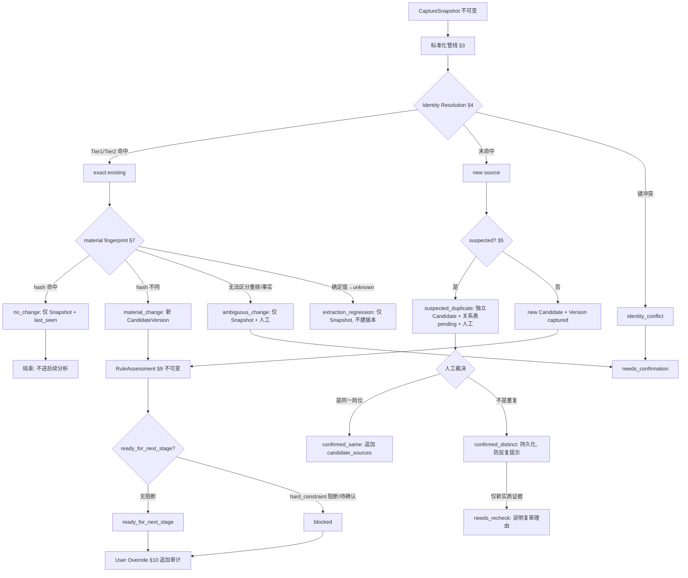

# OfferFlow v0.8 V8-3 标准化 / 去重 / 变化识别设计

> 状态：IMPLEMENTED（沙箱/演练，schema≥v8）— 生产 schema 仍 v7、Radar 正式入口仍 DISABLED
> 实施证据：`docs/evidence/offerflow-v0.8-v8-3-review-workbench-2026-07-23.md`
> 说明：本文为设计基线，正文保留原始设计意图；实施差异与最终边界以上方实施证据为准。
> 波次：V8-3
> 权威上游：`docs/technical/offerflow-v0.8-technical-design.md`（§4.5–4.7、§5）、`docs/prd/offerflow-v0.8.md`（P0-06/P0-07、US-03/US-04）、`docs/product/offerflow-v0.8-release-contract.md`（RC-05/RC-06）、`docs/evaluation/offerflow-v0.8-evaluation-plan.md`（§5.1）
> 目标：把事实整理准确、识别重复和变化、并保留可审计证据。不是开始智能判断。
> 本文只做设计与影响分析，不含任何实现、迁移或数据库脚本。

## 0. 本轮范围与红线

**本轮设计能力（且仅这些）：** 输入字段标准化；缺失字段保持 unknown；确定重复识别；疑似重复进入人工确认；无实质变化不创建新 CandidateVersion、不重复进入后续分析；实质变化创建新的不可变 CandidateVersion；透明规则展示命中字段/原文/规则；用户覆盖规则结果留下完整审计。

**本轮禁止设计或实现：** AI 分析任务、推荐排序、误区诊断、RadarAction 业务交互、自动更新岗位画像、自动来源扫描、自动滚动/翻页/筛选/巡航/投递/聊天、新 AI Provider、BYOK、RAG、v0.9 实现。

**关键命名对齐（用户任务书 → 实际代码，以代码为准）：** `companyScale`→`companySize`；`employmentType`→`jobNature`；`skillTags`→`technicalStack`；`address`→**不存在于 normalized**，仅存在于 `raw_snapshot_json.extractionMetadata`；`sourceUpdatedAt`→`radar_source_records.last_changed_at`（来源级，非 normalized 字段）；`recruiterActivitySnapshot`→`extractionMetadata.activityStatus`（仅快照旁注）。设计各表以实际字段名为准，并在 §2 明确标注差异。

**schema 前置结论（2026-07 产品裁决，纠正上一版矛盾）：** 上一版曾同时声称「V8-3 核心可完全复用 v7」与「疑似重复关系与非重复裁决需未来 v8」——但**疑似重复人工确认**与**"不是重复"持久留痕**本身就是 V8-3 核心范围（P0-06/US-03/RC-05），二者矛盾。最终裁决：
- **schema v7 足够** 支撑标准化、exact identity、CandidateVersion fingerprint、no-change、material-change、Snapshot 保留、基础 RuleAssessment，以及现有 `radar_actions` 能承载的部分用户覆盖；
- **完整 V8-3 必需一个最小化 schema v8**：持久化疑似重复候选对、`confirmed_distinct`、防重复提示、重新审查状态、必要的 duplicate 裁决 `action_type`，以及审计后确认必需的规则证据字段；
- **schema v8 是 V8-3 正式实施的前置条件**，不再标记为"非阻断未来优化"（见 §14、§14b）；
- 本轮**只设计 schema v8**，不创建 migration、不修改生产数据库、不改 `PRODUCTION_SCHEMA_VERSION`；
- schema v8 **保持最小化**，只解决候选关系持久化与必要审计枚举，**不得**引入 AI 任务、推荐结果、自动来源、v0.9 巡航、新 Provider、BYOK、RAG。

## 1. 当前基线（V8-2 实测，含 file:line）

### 1.1 V8-2 输入到 CandidateVersion 的现有链路

commit 编排：[server/radar/service.ts:180](server/radar/service.ts:180) `commitSession` → 每个 preview item 走 `materializeItem`（[service.ts:273](server/radar/service.ts:273)），事务边界与幂等指纹在 [service.ts:180-226](server/radar/service.ts:180)。

写入顺序（`materializeItem`）：
1. 插入不可变 `CaptureSnapshot`（[service.ts:298](server/radar/service.ts:298)），`raw_snapshot_json` 仅含 `captureMethod`/`visibleText`/`extractionMetadata`（[service.ts:287-293](server/radar/service.ts:287)）。
2. 身份解析 `findExistingSourceRecord`（[service.ts:409](server/radar/service.ts:409)）。
3. 标准化 `buildNormalized`（[service.ts:74](server/radar/service.ts:74)）→ `contentHash = sha256RequestHash(normalized)`（[service.ts:302](server/radar/service.ts:302)）。
4. 已有来源 + 已有 candidate + 同 `content_hash` 命中 → `kind:'unchanged'`，不建版本（[service.ts:314-324](server/radar/service.ts:314)）；否则建新版本 `kind:'new_version'`。
5. 无来源 → 新建 SourceRecord + Candidate + Version + `linkSource(link_reason:'primary')`（[service.ts:337-371](server/radar/service.ts:337)），返回 `kind:'created'`。

版本创建 `insertNewVersion`（[service.ts:383](server/radar/service.ts:383)）：`versionNo=nextVersionNo`；`originType = activeVersionId===null ? 'captured' : 'source_change'`；`supersedesVersionId=` 旧 active；`qualityIssues=[]`；随后 `setActiveVersionId`。

### 1.2 已有的 exact identity 逻辑

`findExistingSourceRecord`（[service.ts:409-419](server/radar/service.ts:409)）：
- Tier 1：`providerKey` 与 `externalRecordId` 均非 null → `sourceRecords.findByProviderKey(...)`；
- Tier 2：`normalizedSourceUrl` 非 null → `sourceRecords.findByNormalizedSourceUrl(...)`；
- 否则返回 null（视为新来源）。

URL 规范化 `normalizeSourceUrl`（[server/radar/normalize.ts:2](server/radar/normalize.ts:2)）：小写 host、去默认端口、去 fragment，**保留 path + query**。`content_hash` 用 `sha256RequestHash`（[server/job-memory/requestHash.ts:27](server/job-memory/requestHash.ts:27)），canonical JSON 递归按 key 排序、保留数组顺序、拒绝 `undefined`/非有限数。

现有候选查找仅 `findByPrimarySourceRecordId`（[service.ts:312](server/radar/service.ts:312)）——只认 primary 来源，未走 `radar_candidate_sources` 链表。

### 1.3 schema v7 可直接支持的能力

由 [server/migrations/radarDomainSchemaV7.ts:10](server/migrations/radarDomainSchemaV7.ts:10) 落地（真实生产库已激活，12 表为空）：
- 不可变 Snapshot（`raw_content_hash` NOT NULL）；
- `radar_source_records`：`UNIQUE(provider_key, external_record_id)`（[v7:71](server/migrations/radarDomainSchemaV7.ts:71)）、`last_changed_at` nullable、`source_status IN ('active','unknown')`；
- `radar_candidate_versions`：`UNIQUE(candidate_id, version_no)` 与 `UNIQUE(candidate_id, content_hash)`（[v7:103-104](server/migrations/radarDomainSchemaV7.ts:103)）、`origin_type` 四值、`supersedes_version_id` nullable、`quality_issues_json`/`source_snapshot_ids_json` 已备；
- `radar_candidate_sources.link_reason IN ('primary','confirmed_duplicate','probable_confirmed','manual')`（[v7:115](server/migrations/radarDomainSchemaV7.ts:115)）；
- `radar_rule_assessments`：`rule_version`/`rule_key`/`category`/`severity`/`result(hit|pass|unknown)`/`matched_text`/`source_path`/`explanation`（[v7:121-136](server/migrations/radarDomainSchemaV7.ts:121)）；
- `radar_actions.action_type` 含 `rule_override_set`/`rule_override_reverted`（[v7:232-233](server/migrations/radarDomainSchemaV7.ts:232)）、`reverted_by_action_id` 自引用、`metadata_json`。

### 1.4 当前缺失或仅占位的部分

| 能力 | 现状 | 证据 |
|---|---|---|
| 字段标准化（trim/canonical/解析） | 缺失，纯 passthrough | `buildNormalized` [service.ts:74-98](server/radar/service.ts:74) |
| district/companySize/industry/jobNature/workMode/technicalStack/responsibilities/requirements/publishedAt | 恒为 null/`[]` | 同上 |
| unknown / ambiguous / 冲突分类 | 缺失（只有 null） | 同上 |
| 材料字段专用 no-change fingerprint | 缺失；hash 覆盖整个 normalized 含 `rawDescription` | [service.ts:302](server/radar/service.ts:302) |
| 字段级变化分类（salary/location/content/manual） | 缺失；仅返回 created/unchanged/new_version | [service.ts:66](server/radar/service.ts:66)、[service.ts:316-333](server/radar/service.ts:316) |
| `origin_type='manual_correction'` | 从未产出（纠错仍记 source_change，且 `correctionNote` 被丢弃） | [service.ts:398-399](server/radar/service.ts:398) |
| quality_issues 生成 | 恒 `[]` | [service.ts:395](server/radar/service.ts:395) |
| 疑似重复 / probable_confirmed / 人工裁决 | 缺失；link_reason 恒 primary | [service.ts:370](server/radar/service.ts:370) |
| 规则引擎 → RuleAssessment 写入 | commit 从不调用；repo 仅 insert/list | [ruleAssessmentRepository.ts:15](server/radar/ruleAssessmentRepository.ts:15) |
| 用户覆盖捕获 | 缺失（action 类型已备，无写入路径） | — |

### 1.5 V8-3 与相邻波次边界

- **V8-2（CLOSED/FROZEN）：** 采集桥、preview、correction、commit 幂等骨架。V8-3 在其产出的 Snapshot/SourceRecord/Candidate/Version 之上增加标准化与判定逻辑，不改采集协议。
- **V8-3（本轮）：** 标准化、unknown 保留、确定/疑似重复、no-change/material-change、透明规则证据、用户覆盖审计。
- **V8-4（不在本轮）：** 单岗位 AI 分析（`job_match_analysis_records`、AI Payload）。V8-3 只决定"是否具备后续分析资格"，不触发分析。
- **V8-5（不在本轮）：** 误区诊断、推荐批次。
- **v0.9（仅设计）：** 自动巡航、只读批量接口。V8-3 不涉及。

## 2. 标准化字段矩阵

字段以 `RadarCandidateNormalized`（[src/domain/radar/types.ts:98-117](src/domain/radar/types.ts:98)、Zod [src/domain/radar/schemas.ts:41-60](src/domain/radar/schemas.ts:41)）为准。列含义：**身份**=是否参与去重身份键；**FP**=是否进入 no-change fingerprint；**MC**=是否属于 material change；**确认**=需人工确认的情形。

| 字段 | 原始来源 | 当前类型 | canonical 类型 | 允许标准化 | unknown | ambiguous | 冲突处理 | 身份 | FP | MC | 确认 |
|---|---|---|---|---|---|---|---|---|---|---|---|
| providerKey | 扩展/快照 | `string\|null` | 小写枚举串 | trim+小写 | null=未知来源 | — | 冲突→不合并 | 是 | 否 | 否 | 否 |
| externalRecordId | 扩展/快照 | `string\|null` | 原样 trim | trim | null | — | 同 provider 下冲突→§4 | 是 | 否 | 否 | 否 |
| sourceUrl | 快照 | `string\|null` | 原样 | 仅存储 | null | — | — | 否 | 否 | 否 | 否 |
| canonicalSourceUrl（=normalizedSourceUrl） | `normalizeSourceUrl` | `string\|null` | 小写host/去端口/去fragment/**保留query** | 见 §4 建议加强 | null | — | — | 弱(Tier2) | 否 | 否 | 否 |
| role | recognizedFields | `string\|null` | trim+内部空白折叠 | trim/折叠空白 | null | 疑似岗位名串位→ambiguous | 与 company 相等→ambiguous | 否 | 是 | 是 | 是(ambiguous) |
| company | recognizedFields | `string\|null` | trim+折叠 | trim/折叠；不剥离主体后缀 | null | 截断/猎头名→ambiguous | — | 否 | 是 | 是 | 是(ambiguous) |
| city | recognizedFields | `string\|null` | trim；仅城市名 | 从受控解析取城市 | null | 多城市→ambiguous | 与 district 混淆→保 city | 否 | 是 | 是 | 是 |
| district | 恒 null（V8-2） | `string\|null` | trim | 从 extractionMetadata 提升（受控） | null | — | — | 否 | 是 | 是 | 否 |
| salaryMinK / salaryMaxK | recognizedFields | `number\|null` | 千元/月整数或小数 | 解析带单位区间 | null（PUA/缺失） | min>max→ambiguous | 单位不明→unknown | 否 | 是 | 是(salary_changed) | 是 |
| salaryPeriod | recognizedFields | `string\|null` | 枚举(月/年/日) | 枚举归一 | null | — | 与区间不符→ambiguous | 否 | 是 | 是 | 否 |
| experienceRequirement | recognizedFields | `string\|null` | 原文标签保留 | trim；不推断年限 | null | "经验丰富"→保原文,不推断 | — | 否 | 是 | 是 | 否 |
| educationRequirement | recognizedFields | `string\|null` | 原文标签保留 | trim；不推断硬门槛 | null | "学历优先"≠硬门槛 | — | 否 | 是 | 是 | 否 |
| companySize | 恒 null | `string\|null` | 原文档位 | trim | null | — | — | 否 | 是 | 是 | 否 |
| industry | 恒 null | `string\|null` | trim | trim | null | — | — | 否 | 否 | 否 | 否 |
| jobNature（employmentType） | 恒 null | `string\|null` | 枚举(全职/兼职/实习/外包) | 枚举归一 | null | — | — | 否 | 是 | 是 | 否 |
| workMode | 恒 null | `string\|null` | 枚举(现场/远程/混合) | 枚举归一 | null | — | — | 否 | 否 | 否 | 否 |
| technicalStack（skillTags） | 恒 `[]` | `string[]` | trim+去重+**排序** | 逐项 trim/去空/去重/排序 | `[]` | — | — | 否 | 是 | 是(content) | 否 |
| responsibilities | 恒 `[]` | `string[]` | 逐条 trim,顺序保留 | 去空行/折叠空白 | `[]` | — | — | 否 | 是 | 是(content) | 否 |
| requirements | 恒 `[]` | `string[]` | 逐条 trim,顺序保留 | 去空行/折叠空白 | `[]` | — | — | 否 | 是 | 是(content) | 否 |
| publishedAt | 恒 null | `number\|null` | epoch ms | 仅确定日期解析 | null | 相对文案不猜 | — | 否 | 否(见 §7) | 否 | 否 |
| rawDescription | visibleText | `string` | 见 §7 | 仅存储原文 | `''` | — | — | 否 | **否**(仅派生 responsibilities/requirements) | 否 | 否 |
| captureMethod | 快照 | 枚举 | — | — | — | — | — | 否 | 否 | 否 | 否 |
| source confidence | extractionMetadata | 自由 | — | 仅旁注 | — | — | 低置信→字段发 null | 否 | 否 | 否 | 是 |
| extraction quality | extractionMetadata | 自由 | — | 仅旁注→quality_issues | — | — | — | 否 | 否 | 否 | 是 |
| recruiterActivitySnapshot（activityStatus） | extractionMetadata | 自由 | — | 仅快照旁注 | — | — | — | **否** | **否** | **否** | 否 |
| capturedAt | 快照 | number | epoch | — | — | — | — | 否 | **否** | 否 | 否 |
| sourceUpdatedAt（last_changed_at） | 来源记录 | `number\|null` | epoch | 系统维护 | null | — | — | 否 | 否 | 否 | 否 |
| correction metadata（correctionNote/originType） | commit | — | — | 见 §8/§10 | — | — | — | 否 | 否 | — | — |

**明确约束：** 招聘者活跃度（`recruiterActivitySnapshot`/`activityStatus`）只属于采集快照旁注，**不参与 identity、不参与 fingerprint、不触发 material change、不产生新 CandidateVersion**——仅在预览只读展示。`capturedAt`、`sourceUpdatedAt`、`source confidence`、来源请求 ID、UI 状态同样一律排除出 fingerprint（§7）。

## 3. 标准化管线（确定性阶段）

阶段顺序固定、每步输入/输出/错误明确；任一阶段**不得静默丢字段、不得覆盖原始事实**，原始值始终可经 `raw_snapshot_json` 追溯。

1. **原始 Snapshot 校验：** 输入 = 已落库 Snapshot + preview item。校验 `raw_content_hash` 非空、visibleText 存在。错误 → 拒绝该项（`SNAPSHOT_INVALID`），不进入后续。
2. **字段级基础清理：** trim 首尾、折叠内部连续空白、统一全角/半角空字符。输出 = 清理后原文映射。空串 → null。
3. **类型解析：** salary 区间、salaryPeriod 枚举、jobNature/workMode 枚举、publishedAt 明确日期。无法安全解析 → unknown（null），**不猜测**。
4. **canonical representation：** 数组去空/去重/（technicalStack）排序；city 只取城市；URL 走 canonical（§4）。responsibilities/requirements 保留顺序。
5. **冲突检测：** company==role、salaryMin>Max、period 与区间不符、city 含区县 → 标 `ambiguous` 并记 quality_issue，字段值置 null 或保守保留。
6. **unknown / ambiguous 分类：** 每字段落入 `known` / `unknown(缺失)` / `ambiguous(冲突或低置信)`；ambiguous 字段进入需人工确认集合。
7. **identity resolution：** 见 §4，产出 identity 决策（exact-existing / new / conflict）。
8. **duplicate resolution：** exact→复用 candidate；否则评估 suspected（§5），产出 pending 关系或独立。
9. **material-change comparison：** 用 §7 fingerprint + §6 字段分类，产出 change type。
10. **rule evidence preparation：** 按 §9 组装规则输入（标准化前/后值 + 原文 excerpt + sourcePath），供规则引擎产出不可变 RuleAssessment。

伪代码（**仅设计，不实现**）：

```text
normalizeCandidate(snapshot, recognized, metadata) -> NormalizeResult:
  cleaned   = basicClean(recognized)                # 阶段2
  parsed    = parseTypes(cleaned)                   # 阶段3，失败→unknown
  canon     = canonicalize(parsed, metadata)        # 阶段4
  conflicts = detectConflicts(canon)                # 阶段5
  classified= classifyFields(canon, conflicts)      # 阶段6 known|unknown|ambiguous
  return {
    normalized:   canon,                            # RadarCandidateNormalized
    qualityIssues:conflicts ++ metadata.qualityIssues,
    needsConfirm: classified.ambiguousFields,
    fingerprint:  materialFingerprint(canon),       # §7，材料字段子集
  }
```

不得用 LLM 补全身份/字段/缺失事实；标准化不等于推断（TD §5.1、任务书 §3.1）。

## 4. Exact duplicate key（确定重复）

**identity key 组成（保守，TD §5.2 Tier 1–2，2026-07 裁决细化）：**
- **Tier 1（强）：** `providerKey`(非空) + `externalRecordId`(非空)。映射到 `radar_source_records UNIQUE(provider_key, external_record_id)`（[v7:71](server/migrations/radarDomainSchemaV7.ts:71)）。
- **Tier 2（弱）：** `providerKey` + `verifiedCanonicalSourceUrl`，当 Tier 1 不可用时。要求：
  - canonical URL 必须经 **provider-specific normalizer** 处理；
  - 必须移除 `securityId` 与全部动态 query（§15、NB2 白名单）；
  - 必须确认是**岗位详情身份 URL**；
  - **普通页面 URL、搜索页 URL、推荐页 URL 一律不参与 exact identity**（无法稳定标识单一岗位）；
  - 当前 `normalizeSourceUrl`（[normalize.ts:2](server/radar/normalize.ts:2)）保留 query 且无 provider 感知，**不满足** Tier 2 要求 → 需 V8-3 实现期新增 provider-specific canonicalizer（属实现细节，非 schema）。
- Tier 3+（内容 hash、相似度、用户裁决）：**不用于自动合并**，仅进 §5 疑似或人工。
- **同一 externalRecordId 跨 provider 不自动合并**（Tier 1 键含 providerKey）；**仅 canonical URL 相同但 provider 不同，不自动合并**。
- **已持久化的 CandidateSourceLink 优先于重新计算**（避免重算漂移覆盖已确认关联）。
- **Tier 2 无唯一约束（重要）：** v7 仅 `UNIQUE(provider_key, external_record_id)`，**`normalized_source_url` 无 UNIQUE**（[v7:71](server/migrations/radarDomainSchemaV7.ts:71)），现有 `findByNormalizedSourceUrl` 是 URL-only 单值查询（[sourceRecordRepository.ts:50](server/radar/sourceRecordRepository.ts:50)）。V8-3 Tier-2 须改为**按 `provider_key + normalized_source_url` 查询**并处理多命中：命中 0 条=new source；命中 1 条=exact-existing；**命中 ≥2 条=identity_conflict 进人工**（绝不任取其一自动合并）。此为查询逻辑修正，不新增唯一约束（避免对历史多来源 URL 施加破坏性约束）；是否加 `(provider_key, normalized_source_url)` 非唯一索引属性能优化，留实现期。

**规则：**
- providerKey 或 externalRecordId 任一为 null → Tier 1 不成立，落 Tier 2。
- canonicalSourceUrl 不可用 → 无法确定重复 → 作为**新来源**创建独立 Candidate（宁可分裂不可误并）。
- **跨 provider 相同 externalRecordId：** 不合并（provider 命名空间独立）——Tier 1 键含 providerKey。
- 同 `providerKey+externalRecordId` 出现**小幅**内容变化（同一岗位微调）→ identity 稳定 → 进 §6 material change（同一 Candidate 新版本），**不新建 Candidate**。
- 同一 exact identity 出现**明显不同的公司或岗位**（疑似身份被复用 / 提取错误 / 来源异常）→ **一律**：不创建第二个 Candidate；不静默覆盖旧版本；**不立即创建新 CandidateVersion**；标记 `identity_conflict`；保存 Snapshot；阻止进入后续分析；等待人工确认（身份复用 / 提取错误 / 来源异常）。

**SourceRecord ↔ Candidate 关联：** 一个 SourceRecord 通过 `radar_candidate_sources` 关联 Candidate；`link_reason='primary'` 为主来源。多个 SourceRecord 可 confirmed_duplicate 关联同一 Candidate（人工确认后）。已存在 `CandidateSourceLink` 优先级：primary > confirmed_duplicate > probable_confirmed > manual。

**identity 冲突必进状态：** `identity_conflict`（不自动写版本，进人工确认队列）。

**唯一约束映射：** Tier1→`UNIQUE(provider_key, external_record_id)`；版本幂等→`UNIQUE(candidate_id, content_hash)`、`UNIQUE(candidate_id, version_no)`（[v7:103-104](server/migrations/radarDomainSchemaV7.ts:103)）。

**判定决策表：**

| providerKey | externalRecordId | canonicalUrl | 已有来源? | 结果 |
|---|---|---|---|---|
| 非空 | 非空 | 任意 | 命中Tier1 | exact-existing |
| 非空 | 非空 | 任意 | 未命中 | new source |
| 非空 | null | verified 非空 | 命中Tier2(单条) | exact-existing |
| 非空 | null | verified 非空 | 未命中 | new source |
| 非空 | null | verified 非空 | **命中Tier2 多条** | identity_conflict → 人工（见下） |
| null | — | 任意 | — | new source（**providerKey 为空则无 exact identity**） |
| — | — | null/非详情URL | — | new source（隔离） |
| 非空 | 非空 | — | 命中Tier1但内容为完全不同岗位 | identity_conflict → 人工 |

**冲突场景表：**

| 场景 | 处理 |
|---|---|
| 同 Tier1 键，company/role 小幅变化 | material change，同 Candidate 新版本 |
| 同 Tier1 键，明显不同岗位（疑似 ID 复用） | identity_conflict，人工裁决，不静默 |
| 不同 Tier1 键，canonicalUrl 相同 | 疑似重复（§5），不自动并 |
| Tier1 与 Tier2 指向不同 Candidate | identity_conflict，人工裁决 |

## 5. 疑似重复边界（只标记，不合并；持久化候选关系）

以下只能标记 suspected duplicate，**V8-3 绝不自动合并**（PRD P0-06「疑似重复不得静默合并」、RC-05）：
- 同公司、同岗位名、不同 externalRecordId；
- canonicalUrl 无法确认但文本高度接近；
- 同一岗位被不同招聘主体（甲方 vs 猎头）发布；
- 公司展示名截断 / 主体名与品牌名不同；
- 岗位标题轻微变化；
- 同一公司多个相似岗位。

**核心规则（B1/B2 已裁决）：**
- suspected duplicate 生成一条**持久化候选关系**（`radar_candidate_relations`，见 §14b），status=`suspected_duplicate`；**绝不**写入 `radar_candidate_sources`、**绝不**只存前端内存或 transient task。
- 人工确认前两个 Candidate 保持独立、各自 active。相似度/文本接近**永不**触发自动合并，只作提示信号。
- 人工确认为"是同一岗位" → 关系置 `confirmed_same`，并追加 `radar_candidate_sources` 链接（`link_reason='confirmed_duplicate'`/`probable_confirmed'`）+ 记 RadarAction 审计（§10）。
- 人工确认为"不是重复" → 关系置 `confirmed_distinct`（**P0 硬需求，见下**）。
- **禁止**用岗位/公司/JD 相似度直接修改 Candidate 归属。

**B2：`confirmed_distinct` 是 P0 硬需求（防反复提示）。** 用户确认两个 Candidate 不是同一岗位后，**必须持久化**：候选对、裁决结果、裁决时间、原始疑似信号、用户原因、关联 CandidateVersion、操作者、对应 RadarAction。
- 相同候选对以后**不得因同一批旧信号**再次进入待确认。
- **仅当出现新的实质证据**时才允许重新进入 `needs_recheck`，例如：任一 Candidate 创建了新的实质版本；公司主体从 unknown 变为确定且变得一致；出现新的稳定来源关联；external identity 被纠正；用户主动撤销旧裁决。
- 重新提示**必须说明**：旧裁决是什么、新出现了什么证据、为什么需要重新确认。
- **不得**因采集时间、招聘者活跃度或置信度变化而重新提示。

**存储载体（B1 已裁决）：** 现有 `radar_candidate_sources` 只适合**已确认的来源关联**（4 个 link_reason 均为已定关系），**无法**表达两个独立 Candidate 间的 pending 疑似关系或"已判定非重复"。因此**批准最小 schema v8** 新增专用**候选关系表**（`radar_candidate_relations`）+ 必要的 duplicate 裁决 `action_type`——完整设计见 §14b。当前关系状态可查询存于关系表，每次裁决/撤销/重判的追加式事件存于 `radar_actions`（当前状态与审计分离，不丢历史）。

## 6. Material change 定义

字段分类：

- **A 身份字段：** providerKey、externalRecordId、canonicalSourceUrl。变化=不同来源身份，不属版本内变化。
- **B 实质变化字段（进 fingerprint，变化→新版本）：** role、company、city、district、salaryMinK/MaxK、salaryPeriod、experienceRequirement、educationRequirement、companySize、jobNature、technicalStack、responsibilities、requirements。
- **C 非实质快照字段（不进 fingerprint）：** capturedAt、recruiterActivitySnapshot、sourceUpdatedAt、source confidence、industry、workMode、publishedAt、rawDescription 原文本身。
- **D 质量与纠错字段：** qualityIssues、correctionNote、originType。
- **E 派生字段：** contentHash（由 B 计算）、versionNo。

**决策表：**

| 变化 | material? | 建 Version? | 仅建 Snapshot? | 需人工确认? | 触发后续分析资格? |
|---|---|---|---|---|---|
| role 变化 | 是 | 是(content_changed) | 否 | 若 ambiguous | 是 |
| company 变化 | 是 | 是 | 否 | 若 ambiguous | 是 |
| city 变化 | 是 | 是(location_changed) | 否 | 否 | 是 |
| address 变化（仅快照） | 否 | 否 | 是 | 否 | 否 |
| 薪资上/下限变化 | 是 | 是(salary_changed) | 否 | 否 | 是 |
| salaryPeriod 变化 | 是 | 是(salary_changed) | 否 | 否 | 是 |
| 经验要求变化 | 是 | 是(content_changed) | 否 | 否 | 是 |
| 学历要求变化 | 是 | 是(content_changed) | 否 | 否 | 是 |
| JD 有新增/删除职责或要求 | 是 | 是(content_changed) | 否 | 否 | 是 |
| skillTags(technicalStack) 变化 | 是 | 是(content_changed) | 否 | 否 | 是 |
| 公司规模变化 | 是 | 是(content_changed) | 否 | 否 | 是 |
| 招聘者活跃度变化 | 否 | 否 | 是 | 否 | 否 |
| capture timestamp 变化 | 否 | 否 | 是 | 否 | 否 |
| extraction confidence 变化 | 否 | 否 | 是 | 否 | 否 |
| 用户纠错（改变事实） | 是 | 是(origin=manual_correction) | 否 | 否 | 是 |
| 用户纠错（无事实变化） | 否 | 否 | 否 | 否 | 否 |
| **unknown → 确定值** | 是 | **是**(content_changed；origin 按来源 captured/manual_correction) | 否 | 否 | 是 |
| **确定值 → unknown** | 否（**退化，见 §6.5**） | **否**（不建退化版本） | **是**（标 extraction_regression/needs_correction，阻止覆盖当前版本） | **是（默认，除非来源明确取消该字段）** | 否 |
| **确定值 A → 确定值 B** | 是 | 是(记 A→B 字段级变化) | 否 | 否 | 是 |
| **ambiguous（冲突值/不能确定的新值）** | 否 | 否（**不自动改 active version**） | **是**（进 §6.4 ambiguous_change） | 是 | 否（先确认） |
| responsibilities/requirements/skillTags 仅顺序/编号/标点调整 | 否 | 否 | 是 | 否 | 否 |
| JD 仅空格/标点/编号/格式变化 | 否 | 否 | 是 | 否 | 否 |
| JD 无法可靠拆分、无法判定纯重排 vs 内容变化 | 否 | 否（**进 §6.4**） | 是 | 是 | 否 |
| 同岗位重发, externalRecordId 不变, 内容同 | 否(unchanged) | 否 | 是 | 否 | 否 |

**关键裁决：** "unchanged" 也需保留新 Snapshot（来源被再次看到）+ 更新 `source_records.last_seen_at`，但**不建新 Version**；只有实质字段的 fingerprint 变化才建 Version。这修正当前基线用整个 normalized（含 rawDescription）算 hash 导致的过度建版本问题（§1.4）。

### 6.4 ambiguous_change（不确定是否实质变化）

当冲突值出现、或**无法可靠区分纯重排/格式变化与真实内容变化**时：
- **只保留 Snapshot**，不自动改 active version，不建 content_changed 版本；
- 进入 `needs_confirmation`（新增变化类型 `ambiguous_change`）；
- **禁止**在不确定时直接判 no-change（宁可请人工确认，不可漏判真实变化）；
- 人工确认后：确认为实质变化→建新版本；确认为无变化→仅留 Snapshot。

### 6.5 unknown 状态变化规则（补充裁决）

- **unknown → 确定值 = 事实信息增加：** 建新 CandidateVersion；`originType` 按来源为 `captured` 或 `manual_correction`；记 `changedFields`；恢复后续分析资格。
- **确定值 → unknown = 默认采集质量退化（非事实删除）：** 保存新 Snapshot；**不覆盖**当前 CandidateVersion；**不创建退化版本**；标记 `extraction_regression` / `needs_correction`；**不**重新进入后续分析。**唯一例外：** 来源明确表达该字段已取消/不再适用且有可追溯证据时，经**人工确认**才形成新版本。
- **确定值 A → 确定值 B = 实质变化：** 建新版本；保存 A→B 字段级变化；更新 activeVersionId；允许后续分析。
- **ambiguous（冲突/不确定）：** 仅留 Snapshot；不自动改 active version；进 §6.4。

`CandidateChangeType`（TD §5.4）在实现期需扩展承载 `ambiguous_change`、`extraction_regression`（或以 quality_issue + needs_confirmation 组合表达）——属服务层枚举，不改 schema。

## 7. No-change fingerprint（确定性、版本化，v1 最终裁决）

**fingerprint 版本前缀（正式）：** `radar-candidate-version:v1`。hash 输入 = `prefix + "\n" + canonicalJson(materialPayload)`。身份字段在 fingerprint **之前**单独处理（§4），不进入 payload。

**7.1 明确不包含（即使值变化也不改 fingerprint）：** `providerKey`、`externalRecordId`、`sourceUrl`、`canonicalSourceUrl`、`capturedAt`、`sourceUpdatedAt`、`recruiterActivitySnapshot`、extraction confidence、extraction quality、`requestId`、`sessionId`、Snapshot ID、Candidate ID、UI 状态、correction 操作时间、raw metadata。

**7.2 应包含（规范化后的实质事实字段；以现有 `RadarCandidateNormalized` 为最终映射，不设计取不到的空字段）：**
- 标量：`role`、`company`、`city`、`district`、`salaryMinK`、`salaryMaxK`、`salaryPeriod`、`experienceRequirement`、`educationRequirement`、`jobNature`(=employmentType)、`companySize`(=companyScale)；
- 数组：`responsibilities`、`requirements`、`technicalStack`(=skillTags)；
- material JD representation（见 7.4）。
- **映射注记：** 用户任务书列出的 `address`/`workMode`/`industry` 在 `RadarCandidateNormalized` 中：`workMode`/`industry` 存在但**归为 §6 C 类非实质字段**（不入 fingerprint，见 §6）；`address` **不在 normalized**（仅快照旁注），不入 fingerprint。V8-3 **不为其新建空字段**。

**7.3 数组按规范化集合比较（B3 裁决）：** `responsibilities`、`requirements`、`technicalStack`（及 skillTags 同义）在 fingerprint 中按**规范化集合**比较——规范化包括：trim；统一空白；去除纯编号前缀（`1.`/`①`/`- `）；去除无语义项目符号；明确的大小写统一；去重；稳定排序。**仅调整项目顺序不改变 fingerprint、不建新版本。**

**7.4 文本策略：**
- **不直接使用未处理的 rawDescription**；优先使用规范化后的结构字段；
- raw JD 只在结构字段不足时作**保守 material representation**（折叠空白/统一换行/去零宽/去编号，不重排语义）；
- 纯格式变化（空格/标点/换行/编号）不得改变 fingerprint；
- **无法区分"纯格式/顺序变化"与"事实变化"时，不得直接判 no-change** → 进入 `ambiguous_change` / `needs_confirmation`（§6.4）。

**7.5 fingerprint 结构：**

```text
prefix         = "radar-candidate-version:v1"
materialPayload= { <7.2 字段, 数组按 7.3 规范化为有序集合> }
contentHash    = sha256(prefix + "\n" + canonicalJson(materialPayload))
```

hash 算法沿用 `sha256RequestHash` 的 canonical JSON 语义（[requestHash.ts:27](server/job-memory/requestHash.ts:27)，key 排序、拒绝 undefined/非有限数），**但前缀参与 hash** 以隔离算法升级。null/unknown/empty 统一为 `null`。

**7.6 no-change 判断流程：** 计算新 fingerprint → `findVersionByContentHash(candidateId, contentHash)`：命中=unchanged（不建版本、仅留 Snapshot + 更新 last_seen），否则=material change（建版本）。

**7.7 版本化与兼容：**
- `content_hash` **隐含前缀版本**，旧版本 hash 天然不同名空间；
- 旧 CandidateVersion（V8-2 用整-normalized hash 含 rawDescription）与 v1 fingerprint **不可直接比较**——见 §14 兼容；
- 前缀升级（v2…）时：不重算历史行（不可变），只对新采集用新版本；比较仅在同前缀内有效，跨前缀一律走一次完整 material 比较（保守：可能多建一版本，但**绝不误判 unchanged**）。

## 8. CandidateVersion 创建决策

**状态决策表：**

| 场景 | 建 Snapshot | 建 SourceRecord | 建 Candidate | 建 Version | 更新 activeVersionId | 后续分析资格 | 人工确认 | 审计 |
|---|---|---|---|---|---|---|---|---|
| 新身份 | 是 | 是 | 是 | 是(captured) | 是 | 是 | 否 | link=primary |
| 已知身份+无变化 | 是 | 否(更新last_seen) | 否 | 否 | 否 | 否 | 否 | last_seen 更新 |
| 已知身份+实质变化 | 是 | 否(更新last_changed) | 否 | 是(source_change) | 是 | 是 | 否 | change_type |
| 已知身份+仅快照变化 | 是 | 否(更新last_seen) | 否 | 否 | 否 | 否 | 否 | 快照旁注 |
| identity 冲突 | 是 | 否 | 否 | 否 | 否 | 否 | 是 | identity_conflict 记录 |
| suspected duplicate | 是 | 是(独立) | 是(独立) | 是(captured) | 是 | 是 | 是 | **`radar_candidate_relations` status=suspected_duplicate（§14b）** |
| 用户纠错(无事实变化) | 否 | 否 | 否 | 否 | 否 | 否 | — | override 审计(§10) |
| 用户纠错(有事实变化) | 否 | 否 | 否 | 是(manual_correction) | 是 | 是 | 否 | correctionNote+override |
| **确定值→unknown（退化）** | 是 | 否(更新last_seen) | 否 | **否** | **否** | **否** | 是 | extraction_regression/needs_correction（§6.5） |
| **ambiguous_change** | 是 | 否 | 否 | 否 | **否** | 否 | 是 | ambiguous_change（§6.4） |
| Snapshot 质量不足 | 是 | 视情况 | 否 | 否 | 否 | 否 | 是 | quality_issue |
| 来源字段冲突 | 是 | 是 | 是 | 是(captured,标ambiguous) | 是 | 否(先确认) | 是 | quality_issue |

**修正当前基线：**
- `originType` 需支持 `manual_correction`（纠错事实变化时），当前恒 `captured`/`source_change`（[service.ts:398](server/radar/service.ts:398)）；
- `correctionNote` 需真正写入版本，当前恒 null（[service.ts:399](server/radar/service.ts:399)）；
- 候选查找需走 `radar_candidate_sources` 全链（含 confirmed_duplicate），不止 primary（[service.ts:312](server/radar/service.ts:312)）；
- `quality_issues` 需按 §2/§3 填充，当前恒 `[]`（[service.ts:395](server/radar/service.ts:395)）。

## 9. Rule evidence contract（透明规则证据）

规则证据结构（设计契约，映射到 `radar_rule_assessments`）：

```text
ruleId              -> 建议 = radar_rule_assessments.id
ruleVersion         -> rule_version   (v7 已备)
ruleKey             -> rule_key
ruleCategory        -> category (hard_constraint|risk|preference|state_suppression)
candidateId         -> candidate_id
candidateVersionId  -> candidate_version_id (INV-04 绑定明确版本)
outcome             -> result (hit|pass|unknown)
matchedFieldPath    -> source_path
rawValue            -> (缺口，见下)
normalizedValue     -> (缺口，见下)
evidenceExcerpt     -> matched_text (需长度上限，≤200 字，不复制整段 JD)
evidenceSource      -> (缺口：区分 normalized 字段 vs snapshot 原文)
sourceSnapshotId    -> (缺口)
explanation         -> explanation (NOT NULL)
severity            -> severity
confidence          -> (缺口)
blocking            -> 可由 category=hard_constraint 派生，或新增列
createdAt           -> created_at
supersededBy        -> (缺口：规则版本升级后旧结果关联)
userOverrideState   -> 不入本表，由 RadarAction 记录（TD §4.7）
```

**要求与裁决：**
- evidenceExcerpt 有长度上限（≤200 字），**不复制完整 JD**；原文经 `sourceSnapshotId` 可回溯 Snapshot。
- 同一规则多处命中：每处一行 RuleAssessment（`rule_key` 相同、`source_path`/`matched_text` 不同），不聚合成一行。
- 未命中（pass）是否持久化：**持久化**（透明性要求可展示"检查过且通过"），与 unknown 区分。
- unknown（无法判定，如字段缺失）与 false/pass（判定为不命中）**必须区分** → 已由 `result IN ('hit','pass','unknown')` 表达。
- rule error（规则执行异常）与 not matched：v7 result 枚举无 `error` 值 → 规则执行异常**不写 RuleAssessment**，改记 quality_issue 或任务错误，避免污染 pass/unknown 语义（设计结论，非开放问题）。
- 规则版本升级：旧结果**不 UPDATE、不删除**（INV：结果不可变）；新版本追加新行，用 `supersededBy`（缺口列）或按 `(candidate_version_id, rule_version)` 查询区分。

**`radar_rule_assessments` 能否承载：** 核心字段（ruleVersion/ruleKey/category/severity/result/matched_text/source_path/explanation）**已足够**表达 P0-07 与 RC-06 的"命中原文+规则+字段"，属 schema v7 范围。缺口字段：`rawValue`、`normalizedValue`、`evidenceSource`、`sourceSnapshotId`、`confidence`、`supersededBy`。
- 能否放现有列？`matched_text` 可暂载 excerpt；`source_path` 载字段路径。rawValue/normalizedValue/sourceSnapshotId **无对应列**。
- 是否纳入 schema v8？属 **BR-2 开放决策**（§16）：若审计确认这些为 RC-06 硬需求，则在 v8 内对本表增列或增 `evidence_json`（§14b.6，v8 内可选附加，不阻断 B1/B2 主体）；若非硬需求，V8-3 用现有列承载、v8 不含此项。本轮**不建 migration**。

## 10. 用户覆盖审计结构

用户可覆盖：规则结果、suspected duplicate 判断、字段纠错、material change 判定、版本确认状态。

**覆盖记录字段（设计契约）：**

```text
overrideId, targetType(rule|duplicate|field|material|version_confirm),
targetId, originalValue, overriddenValue, reason, actor, source,
createdAt, relatedSnapshotId, relatedCandidateVersionId, ruleVersion,
reversible(bool), reversalOfOverrideId, supersedesOverrideId
```

**要求（追加式，不可变）：**
- 覆盖**不修改**原始 Snapshot、**不修改**旧 CandidateVersion、**不 UPDATE** `radar_rule_assessments`；
- 每次覆盖形成**追加**审计记录；恢复默认值也形成**新记录**（不删旧）；
- 不能只保存最终状态——全过程可回放。

**映射到现有 schema（TD §4.7、§4.11）：** 规则覆盖由 `radar_actions` 记录：
- `action_type='rule_override_set'` / `'rule_override_reverted'`（[v7:232](server/migrations/radarDomainSchemaV7.ts:232) 已备）；
- `metadata_json` 载 `{ ruleAssessmentId, decision, reason, originalResult }`；
- `reverted_by_action_id` 自引用表达撤销链（[v7:240](server/migrations/radarDomainSchemaV7.ts:240)）；
- 绑定 `candidate_id`+`candidate_version_id`（NOT NULL）。

**schema 边界：**
- 规则覆盖：**schema v7 足够**（radar_actions `rule_override_set/reverted` 完全够用）。
- 字段纠错：由 CandidateVersion(origin=manual_correction)+correctionNote 表达，**schema v7 足够**。
- suspected duplicate 裁决：**当前状态**存 `radar_candidate_relations`（v8，§14b），**裁决/撤销/重判事件**追加式存 `radar_actions`（新增 `duplicate_confirmed`/`duplicate_rejected`/`duplicate_decision_reverted`/`duplicate_recheck_requested`，§14b.5）——**需 schema v8**。
- confirmed_distinct 防重复提示：由关系表唯一约束 + `needs_recheck` 承载（§14b.3）——**需 schema v8**。
- 恢复默认/撤销：均为 radar_actions 追加事件 + 关系表状态回写，不删旧记录。

本轮只设计不改 schema/不建 migration；duplicate 裁决所需 `action_type` 扩展与关系表属 schema v8 设计（§14b），激活须单独授权（BR-1）。

## 11. 领域状态与流程图



**核心状态（建议名，须先复核既有模型避免重复体系）：**

```text
normalized            标准化完成
identity_resolved     身份已解析(exact/new)
suspected_duplicate   疑似重复,待人工(→ radar_candidate_relations)
confirmed_distinct    人工判定非重复,持久化,防反复提示
needs_recheck         已判定关系因新实质证据需复审
no_change             无实质变化,不建版本
material_change       实质变化,已建新版本
extraction_regression 确定值→unknown 退化,只留 Snapshot,不建版本
ambiguous_change      无法区分重排/事实变化,待人工
needs_confirmation    identity_conflict / ambiguous / 质量不足 / 疑似 / 退化
ready_for_next_stage  具备后续分析资格(V8-4,本轮不触发)
blocked               hard_constraint 阻断或待确认
```

**关系状态（持久，radar_candidate_relations，§14b.2）：** `suspected_duplicate` / `confirmed_same` / `confirmed_distinct` / `needs_recheck` / `superseded`——这是**候选对关系**的持久状态，与下方 candidate lifecycle 不同层。

**复核既有模型：** 现有 `radar_candidates.lifecycle_status`（active|merged|archived）、`radar_capture_sessions.status`（preview|committed|cancelled|expired）、commit 返回 `kind`（created|unchanged|new_version，[service.ts:66](server/radar/service.ts:66)）。上述 V8-3 **判定过程状态**不应与 lifecycle_status 混淆或替代；建议作为服务层返回/`radar_actions` 语义。**关系状态**则是 §14b 新表的持久列（非 lifecycle）。`kind` 可扩展映射 no_change=unchanged、material_change=new_version、new=created，新增 suspected/conflict/blocked/regression/ambiguous 为新 kind 值。

## 12. API / Repository / 文件影响审计（仅分析，不改代码）

| 文件 | 需改? | 原因 | 风险 | 涉 schema? | 需 migration? | 波次 |
|---|---|---|---|---|---|---|
| [server/radar/service.ts](server/radar/service.ts) | 是 | `buildNormalized` 换真标准化管线；hash 换材料 fingerprint；origin=manual_correction；correctionNote 落库；候选查全链；quality_issues 填充；识别 suspected/conflict | 高（核心链路） | 否 | 否 | V8-3 |
| [server/radar/normalize.ts](server/radar/normalize.ts) | 是 | 扩展字段级标准化（salary/枚举/数组/城市），canonicalUrl 加强 | 中 | 否 | 否 | V8-3 |
| （新）`server/radar/fingerprint.ts` | 新增 | 材料字段 fingerprint（§7） | 低 | 否 | 否 | V8-3 |
| （新）`server/radar/changeClassify.ts` | 新增 | 字段级 change type（§6） | 中 | 否 | 否 | V8-3 |
| （新）`server/radar/rules/*.ts` | 新增 | 透明规则引擎（§9，P0-07 规则集） | 中 | 否 | 否 | V8-3 |
| [server/radar/candidateRepository.ts](server/radar/candidateRepository.ts) | 是 | 增按 candidate_sources 全链查候选；confirmed_duplicate 链接 | 中 | 否 | 否 | V8-3 |
| [server/radar/sourceRecordRepository.ts](server/radar/sourceRecordRepository.ts) | 可能 | last_changed_at 语义确认 | 低 | 否 | 否 | V8-3 |
| （新）`server/radar/candidateRelationRepository.ts` | 新增 | 候选关系 CRUD（suspected/confirmed_same/confirmed_distinct/needs_recheck，§14b）；查待确认队列；防重复提示 | 中 | **是（v8 新表）** | **是（v8）** | V8-3（前置 v8） |
| （新）`server/migrations/radarDomainSchemaV8.ts` | 新增（仅设计） | `radar_candidate_relations` 表 + action_type 扩展（§14b）；**本轮不编写 migration** | 中 | **是** | **是（须单独授权）** | V8-3（前置 v8） |
| [server/radar/ruleAssessmentRepository.ts](server/radar/ruleAssessmentRepository.ts) | 是 | 批量插入 + 按 version/category 查询 | 低 | 视 BR-2（§16） | 若纳入证据列则 v8 | V8-3/BR-2 |
| [server/radar/actionRepository.ts](server/radar/actionRepository.ts) | 是 | rule_override 写入/撤销链读取；duplicate 裁决事件（需 v8 action_type，§14b.5） | 低 | duplicate action_type 需 v8 | 是（v8） | V8-3（前置 v8） |
| [server/radar/dtoSchemas.ts](server/radar/dtoSchemas.ts) | 是 | commit 结果新 kind、change_type、needsConfirm、规则证据 DTO、关系 DTO | 中 | 否 | 否 | V8-3 |
| [server/radar/routes.ts](server/radar/routes.ts) | 是 | 暴露规则评估读取、override 写入、疑似确认/裁决（仍 gated DISABLED） | 中（含鉴权，须保持入口关闭） | 否 | 否 | V8-3 |
| [server/radar/rowMappers.ts](server/radar/rowMappers.ts) | 可能 | 若新增证据/关系字段序列化 | 低 | 视 BR-2 | — | V8-3 |
| [src/domain/radar/types.ts](src/domain/radar/types.ts) | 是 | ChangeType/证据/override 类型 | 低 | 否 | 否 | V8-3 |
| [src/domain/radar/schemas.ts](src/domain/radar/schemas.ts) | 是 | 对应 Zod（quality_issue 已备） | 低 | 否 | 否 | V8-3 |
| [src/api/radarApi.ts](src/api/radarApi.ts) | 是 | 前端 API 包装新增只读展示端点 | 低 | 否 | 否 | V8-3 |
| [src/pages/RadarImportPage.vue](src/pages/RadarImportPage.vue) | 是 | 展示未变化/实质变化/疑似、规则命中原文、覆盖入口 | 中 | 否 | 否 | V8-3 |
| [src/pages/radar/commitGate.ts](src/pages/radar/commitGate.ts)、[captureMetadata.ts](src/pages/radar/captureMetadata.ts) | 可能 | 展示层适配 | 低 | 否 | 否 | V8-3 |
| `docs/product/offerflow-v0.8-traceability.md` | 是（本轮） | RC-05/RC-06 标 Design in Review；§1.3 记 schema v8 为 V8-3 前置、B1/B2/B3 已裁决 | 低 | 否 | 否 | V8-3 |
| （潜在）独立产品决策文档 | 待报告 | 仅当 BR-1/BR-2（§16）需独立记录时；本轮不自行新增第三文件 | — | — | — | V8-3 |

**schema v8 说明：** 上表 `涉 schema?=是` 的行仅表示**设计依赖** v8（`radar_candidate_relations` 新表 + duplicate `action_type` 扩展）；本轮**只设计不编写 migration、不改生产库**，v8 迁移与激活须用户单独授权（BR-1，§16）。

**不得混入：** V8-4（`analysisRecordRepository.ts`/`analysisTaskRepository.ts`/`job_match_analysis_records`）、V8-5（`recommendationBatchRepository.ts`/`promotionRepository.ts`）、v0.9 文件——本轮设计不涉及；schema v8 也**不得**顺带引入这些能力。

## 13. 测试计划

### 单元测试（P0）
- 每字段标准化：trim/空白折叠、salary 区间解析、salaryPeriod 枚举、jobNature/workMode 枚举、city 提取、technicalStack 去重排序、responsibilities/requirements 清洗；
- **unknown 保留**：缺失/低置信/无法解析 → null，不猜测（P0，对应任务书 §3.1）；
- canonicalUrl：去 fragment、剥离动态/securityId query、小写 host；搜索页/推荐页 URL 不参与 Tier2（P0）；
- deterministic fingerprint：见 property；
- material change 分类：§6 决策表每行一例（P0），含 unknown→确定值建版本、确定值→unknown 退化不建版本、ambiguous_change（P0）；
- 数组集合比较：responsibilities/requirements/skillTags 仅顺序/编号/标点调整→不建版本；新增/删除/改义→material（P0）；
- identity key：Tier1/Tier2/null 隔离；同 externalRecordId 跨 provider 不合并（P0）；
- suspected duplicate：信号命中→标记不合并（P0）；
- rule evidence：hit/pass/unknown 区分、excerpt 截断、多命中多行；
- user override：追加/撤销/恢复默认各生成新记录。

### Repository 测试（P0）
- exact duplicate 幂等：同输入重复提交不生成第二 Candidate（P0）；
- no-change 不建新版本（P0）；material change 建新版本（P0）；
- 旧 version 不变（不可变，P0）；active version 切换；
- Snapshot 证据保留（unchanged/退化/ambiguous 也留 snapshot，P0）；
- identity conflict 进 needs_confirmation，不建第二 Candidate、不建新版本（P0）；
- concurrent retry（`UNIQUE(candidate_id, content_hash)` 兜底）；transaction rollback 原子性。

### 候选关系测试（P0，依赖 v8 表；v8 未激活前用隔离测试库验证设计）
- 候选对规范化：`(A,B)` 与 `(B,A)` 命中同一关系（P0）；
- 禁止自环（`candidate_id_low <> candidate_id_high`，P0）；
- 同候选对唯一有效关系（`UNIQUE` 防重复提示，P0）；
- confirmed_distinct 持久化后同一批旧信号不再进待确认（P0）；
- 仅新实质证据（新版本/公司确定一致/新来源/identity 纠正/用户撤销）→ needs_recheck（P0）；
- 采集时间/活跃度/置信度变化**不**触发 recheck（P0）；
- 裁决/撤销/重判在 `radar_actions` 追加式留痕，关系表状态回写、历史不丢（P0）。

### API / Service 测试（P0）
- 同一采集重复提交→unchanged；
- 新 Snapshot 无实质变化→不建版本；
- 字段变更→新版本 + change_type；
- suspected duplicate→关系表 pending，不合并（P0）；
- confirmed_distinct→不再反复提示（P0）；
- unknown 字段→保留；correction→manual_correction 版本；
- 确定值→unknown→退化标记、不建版本（P0）；
- override→审计写入；stale/conflict 处理。

### Property / Invariant 测试（P0）
- fingerprint 对 key 顺序不敏感（P0）；
- fingerprint 对非实质字段（capturedAt/活跃度/rawDescription 纯格式）不敏感（P0）；
- fingerprint 对实质变化敏感（P0）；
- 不可变版本永不 UPDATE（P0）；
- fingerprint 数组顺序不敏感、内容增删敏感（P0）；
- exact duplicate 不生成第二 Candidate（P0）；
- suspected duplicate 不自动合并（P0）；
- confirmed_distinct 不因旧信号复现（P0）；
- 确定值→unknown 不产生退化版本（P0）；
- missing ≠ negative（unknown 不等于命中，P0）；
- user override 不删除原始 RuleAssessment、不 UPDATE 关系历史（P0）。

**P0 最小集：** 上述标 (P0) 项——覆盖 RC-05（确定重复不漏、疑似不静默合并、未变化不建版本、实质变化建版本+Diff）与 RC-06（规则透明、命中原文、覆盖留痕）。**可延后：** industry/workMode 等非 fingerprint 字段的展示细节、大规模模糊信号调优。

## 14. 数据迁移与兼容性判断（最终 schema 边界）

**schema v7 足够（无需改表，用既有列与 JSON 字段）：**
- 标准化管线、exact identity、CandidateVersion fingerprint、no-change、material-change、Snapshot 保留、基础 RuleAssessment；
- 现有 `radar_actions` 能承载的部分用户覆盖（`rule_override_set`/`rule_override_reverted`）。

**schema v8 必需（V8-3 正式实施前置条件，非"未来可选优化"）：**
- 持久化 suspected duplicate 候选对（`radar_candidate_relations`，§14b）；
- 持久化 `confirmed_distinct`（B2 P0 硬需求）；
- 防重复提示（关系唯一约束 + `needs_recheck` 重审状态）；
- 关系重新审查状态流转；
- 必要的 duplicate 裁决 `action_type`（§14b.5）；
- 如审计后确认必需的规则证据字段（§9 缺口，见 §14b.6，可选进入 v8）。

**schema v8 最小化红线：** 只解决候选关系持久化与必要审计枚举，**不得**引入 AI 任务、推荐结果、自动来源、v0.9 巡航、新 Provider、BYOK、RAG。

**兼容与迁移：**
- **旧 CandidateVersion 无 v1 fingerprint：** 其 `content_hash` 是 V8-2 整-normalized hash（含 rawDescription），与 `radar-candidate-version:v1` 前缀 hash 不同名空间；比较时对旧版本一律走一次完整 material 比较（保守，可能多建一版本，绝不误判 unchanged）。
- **历史 Snapshot 兼容：** Snapshot 不可变，raw_snapshot_json 结构不变，V8-3 只读取，无需迁移。
- **backfill：** 生产库 Radar 表为空，**当前无历史数据需 backfill**；若未来入口开启前已有采集，backfill 可**惰性执行**（下次采集该来源时重算 fingerprint），不必在入口开启前强制完成。
- **本轮禁止：** 创建 migration、修改生产数据库、改 `PRODUCTION_SCHEMA_VERSION`、实施 backfill、把 schema v8 写成已完成。schema v8 迁移的编写与激活须在用户单独授权后另行进行。

## 14b. schema v8 设计（仅设计，不建 migration）

> 本章仅为**设计**；不编写 migration、不改生产库、不改 `PRODUCTION_SCHEMA_VERSION`。表名 `radar_candidate_relations` 为暂定，最终以现有命名规范为准，但**必须表达候选之间的关系（candidate↔candidate），而非来源关系（candidate↔source）**。

### 14b.1 为何不能复用 `radar_candidate_sources`
`radar_candidate_sources` 是 candidate↔source 的**已确认**关联（link_reason 全为已定关系，[v7:115](server/migrations/radarDomainSchemaV7.ts:115)）。疑似重复是 candidate↔candidate 的**待决 / 已判定非重复**关系，语义、基数、生命周期都不同；混用会污染来源关联并无法表达 pending/distinct/recheck。

### 14b.2 关系状态
- 必须支持：`suspected_duplicate`、`confirmed_same`、`confirmed_distinct`；
- 可增加：`needs_recheck`、`superseded`；
- **不得无边界扩展**（不塞入 AI/推荐/巡航语义）。

### 14b.3 候选对规范化（防 (A,B)/(B,A) 重复与自环）
- 稳定排序：`candidate_id_low = min(a,b)`、`candidate_id_high = max(a,b)`（字典序）；
- `(A,B)` 与 `(B,A)` 视为同一关系；
- **禁止候选与自身建立关系**（`candidate_id_low <> candidate_id_high`，CHECK）；
- **同一候选对只能有一个当前有效关系**（`UNIQUE(candidate_id_low, candidate_id_high)` 承载"当前状态"行，防重复提示）；
- 历史裁决不可被静默覆盖——状态流转的每一步以追加式 RadarAction 记录（§14b.4）。

### 14b.4 建议字段
关系表（当前可查询状态）至少设计：
```text
id
candidateIdLow           -- 规范化后较小 candidate_id
candidateIdHigh          -- 规范化后较大 candidate_id
status                   -- suspected_duplicate|confirmed_same|confirmed_distinct|needs_recheck|superseded
reasonCode               -- 触发/裁决原因码
signalsJson              -- 原始疑似信号（公司/岗位名/URL 接近度等，非相似度分数驱动合并）
firstDetectedAt
lastDetectedAt
resolvedAt               -- nullable
resolutionActionId       -- nullable，指向 radar_actions 裁决事件
createdAt
updatedAt
```
需进一步评估归属（关系表 vs RadarAction 审计）的字段：
```text
sourceCandidateVersionIdLow / sourceCandidateVersionIdHigh  -- 裁决时锚定的版本
detectionRuleVersion                                        -- 检测规则版本
supersededByRelationId                                      -- 关系被新关系取代时的链接
```
**归属裁决：** `sourceCandidateVersionId*` 与 `detectionRuleVersion` 反映"某次裁决基于哪一版本/规则"，属**事件属性** → 优先进 `radar_actions.metadata_json`；关系表只保留可高效查询的当前状态与 `resolutionActionId` 回指。`supersededByRelationId` 属关系拓扑 → 进关系表。

### 14b.5 当前状态与审计分离
- `radar_candidate_relations`：保存**可查询的当前关系状态**（唯一约束防重复提示）；
- `radar_actions`：保存每次用户判定、撤销、重新判定的**追加式审计事件**，**不得只留最终状态而丢历史**。
- 若现有 `radar_actions.action_type` 约束无法表达以下值，则把**最小 action_type 扩展**列为 schema v8 内容：`duplicate_confirmed`、`duplicate_rejected`、`duplicate_decision_reverted`、`duplicate_recheck_requested`。
- **边界：** 这些 action_type 只用于 V8-3 人工裁决审计，**不得**借此引入 V8-5 的通用 RadarAction 业务交互。

### 14b.6 规则证据字段（可选进入 v8，需审计后确认）
§9 缺口字段（`rawValue`/`normalizedValue`/`evidenceSource`/`sourceSnapshotId`/`confidence`/`supersededBy`）**若**经审计确认为 RC-06 硬需求，则作为 v8 内容对 `radar_rule_assessments` 增列或增 `evidence_json`；否则 V8-3 先用 `matched_text`/`source_path`/`explanation` 承载。此项**不阻断** B1/B2 的 v8 主体，属 v8 内的可选附加。

## 15. 安全与隐私边界

- 不将 Cookie / Token / securityId 写入 evidence 或 normalized——这些不在采集字段内，规则证据只取 normalized 值与受控 excerpt；
- canonicalUrl 处理：当前 `normalizeSourceUrl` **保留 query**（[normalize.ts:2](server/radar/normalize.ts:2)）——§16-NB2 建议对含动态 securityId/token 的 query 参数做剥离白名单，避免把易失/敏感 query 当作稳定身份；
- evidenceExcerpt ≤200 字，**不保存完整 JD**（§9）；
- 用户覆盖 metadata 不写敏感来源信息（不含原始 URL query、cookie）；
- 日志不输出完整招聘内容（仅 id/hash/字段名）；
- 疑似重复只在**单用户本地库**内比较，不跨用户（本产品单机 SQLite，天然隔离）；
- 自动规则为**确定性本地规则**，不调用任何外部服务、不使用生成式 LLM（任务书 §3.1、§0）。

## 16. 开放问题与决策请求

### 已裁决（2026-07 产品裁决，原 BLOCKING 已关闭）

**B1（已裁决）— 疑似重复用候选关系专用表。** 批准最小 schema v8 新增 `radar_candidate_relations`（§14b）；不得写入 `radar_candidate_sources`、不得只存前端内存或 transient task、不得用相似度直接改归属。落地：§5 核心规则 + §14b 全表设计 + §14b.5 action_type 扩展。

**B2（已裁决）— `confirmed_distinct` 为 P0 硬需求。** 用户判"不是重复"后必须持久化候选对/结果/时间/信号/原因/关联版本/操作者/RadarAction；相同候选对不得因同一批旧信号反复提示，仅新实质证据可进 `needs_recheck` 且须解释复审理由；不得因采集时间/活跃度/置信度变化重新提示。落地：§5「B2」段 + §14b.2/.3。

**B3（已裁决）— 职责数组顺序不构成实质变化。** `responsibilities`/`requirements`/`skillTags`/`technicalStack` 在 fingerprint 中按规范化集合比较（§7.3）；仅顺序/编号/标点调整不建版本；新增/删除/改变真实含义才是 material change；Snapshot 永远保留原始顺序，仅 fingerprint canonical payload 忽略顺序；无法可靠拆分时进 `ambiguous_change`（§6.4），不得直接判 no-change。

### 仍存在的 BLOCKING DECISION（须用户裁决，无法由工程实现确定且影响数据语义）

**BR-1 — schema v8 迁移的编写与激活授权。** 本轮已完成 v8 **设计**（§14b），但迁移脚本编写、`db:upgrade-real` 激活、`PRODUCTION_SCHEMA_VERSION` 是否推进，均属高风险且改变生产数据语义，**须用户单独授权后另行进行**，不在 V8-3 设计审核内自动获得。

**BR-2 — §9 规则证据缺口字段是否纳入 v8（RC-06 严格性档位）。** `rawValue`/`normalizedValue`/`sourceSnapshotId`/`confidence`/`supersededBy` 是否为 RC-06 硬需求，决定 v8 是否对 `radar_rule_assessments` 增列/增 `evidence_json`（§14b.6）。这改变审计数据模型，需产品裁决"透明规则"证据的最低留存粒度；若判为非硬需求，则 V8-3 用现有列承载、v8 不含此项。

> 说明：其余原 NB 项（fingerprint 命名、URL 白名单、规则异常落点、裁决 action_type）已在 §7.5/§4/§9/§14b.5 内直接裁定为设计结论或实现细节，不再作为独立开放问题。

### IMPLEMENTATION DETAIL（实现期自决，不改数据语义）
- fingerprint 前缀已定为 `radar-candidate-version:v1`（§7.5）；
- canonicalUrl 动态参数剥离白名单的具体参数名（provider-specific，§4/§15）；
- 规则执行异常落 quality_issue/任务错误、不写 RuleAssessment（§9）；
- 各枚举归一的具体词表（月/年/日、全职/兼职等）；
- salary 解析的正则与单位映射细节；
- excerpt 截断的具体字数（≤200 内）与省略号策略；
- 规则集的具体 rule_key 命名（P0-07 列出的规则族）。

---

## 附：完成前自检对照
- 只改本文件与 traceability；无绝对本地路径、无数据库内容、无 Token/Cookie/securityId；
- schema v8 仅**设计**（§14b），未编写 migration、未改生产库、未推进 `PRODUCTION_SCHEMA_VERSION`；未把 schema v8 或 V8-3 写成已实施；
- B1/B2/B3 已落入 §5/§6/§7/§14b/§16；剩余 Blocking 仅 BR-1（v8 迁移授权）、BR-2（规则证据字段档位）；
- 未改 V8-2（CLOSED/FROZEN）/RC-01～RC-04/Radar 正式入口（DISABLED）状态；未实施 v0.9。
